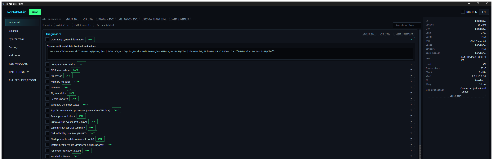

<p align="center">
  
</p>

<h1 align="center">PortableFix</h1>
<p align="center"><i><a href="README.md">Slovenská verzia / Slovak version</a></i></p>

<p align="center">
<a href="https://github.com/vxkShelby/portableFixer/actions/workflows/tests.yml"></a>
<a href="https://github.com/vxkShelby/portableFixer/releases/latest"></a>
<a href="https://github.com/vxkShelby/portableFixer/releases"></a>
<a href="https://github.com/vxkShelby/portableFixer"></a>
</p>

A portable diagnostic and repair tool for Windows 10/11, meant to run
from a USB stick. Python 3.12 + PySide6 GUI, actions run through
PowerShell.

## Screenshot



## Quick start

1. Copy the whole folder to a USB stick (or run directly from disk).
2. Run `PortableFix.cmd` (or `python main.py` in dev).
3. Without admin rights the app runs in diagnostics-only mode; the
   **Restart as Administrator** button unlocks full access.
4. Check the actions you want, verify in **DRY-RUN** mode (on by
   default), then turn DRY-RUN off and run for real.

## Modules

| Module | Category | Contents |
|---|---|---|
| M01 | Diagnostics | System info (OS, HW, disks, processes...), crash triage (stop codes, WHEA, reliability history, crash dumps) |
| M02 | Cleanup | Temp files, cache, recycle bin, Windows Update cache... |
| M03 | Repair | Disk: SMART, disk health verdict, NTFS scan/SpotFix, TRIM, chkdsk on restart |
| M04 | Repair | System integrity: DISM, SFC, AppX, WMI |
| M05 | Repair | Windows Update: service/cache reset, DLL re-registration, detection, Windows 10 ESU status (Consumer ESU ends 2026-10-13) |
| M06 | Repair | Network: DNS, hosts, DHCP, Winsock, TCP/IP |
| M07 | Diagnostics | Autostart: Run registry keys, Startup, tasks, services, WMI, IFEO backdoors, unquoted service paths, inventory without Microsoft entries (signature, SHA256) |
| M08 | Security | Defender, firewall, UAC audit + quick scan, WPBT disable |
| M09 | Repair | Tuning: power plan, visual effects, End Task, Sticky Keys, classic context menu, HAGS, Game DVR (registry tweaks whose undo restores the exact previous state), Storage Sense (report and monthly cleanup with exact undo) |
| M10 | Diagnostics | Drivers: problem devices (+ restart), third-party drivers, network/GPU, backup/restore |
| M11 | — | Reporting (HTML report after every batch, not a catalog) |
| M12 | Diagnostics | Online: layered connectivity test, DNS, proxy |
| M13 | Cleanup | Debloat: telemetry, scheduled tasks, Fast Startup, Explorer ads, Recall/Click to Do |
| M14 | Repair | Printing: printers, drivers and their classes (WPP), PrintBRM backup, SMB/NAS compatibility, offline/ghost printers, spooler reset |
| M15 | Repair | Boot/platform: BCD, TPM, Secure Boot, Secure Boot 2023 certificate verdict (2026-10-19 deadline), WinRE and Quick Machine Recovery readiness, BitLocker, Safe Mode, F8 recovery |
| M16 | Repair | Office: version/channel, Outlook add-ins, OST/PST, quick/full repair |
| M17 | Repair | Browsers: extensions, policy, homepage hijack, profile reset |
| M18 | Repair | Back up user folders (Desktop/Documents/Pictures/Favorites), backup to another drive with a SHA-256 manifest and verification |
| M19 | Repair | Windows optional features: overview, .NET 3.5, PowerShell v2, Sandbox |
| M20 | Repair | Software updates via winget: list, outdated software, update all |
| M21 | Repair | Hardware sensors: PawnIO status/install (CPU temp/clock via LibreHardwareMonitor), battery wear (verdict), RAM test at next restart and its result |
| M22 | Cleanup | Deep cleanup: orphaned uninstall entries, duplicate files, broken shortcuts (.lnk), secure free-space wipe |
| M23 | Antivirus | Microsoft Defender: status, threat history with a verdict, signature update, quick/full/offline scan, exclusions, PUA protection |

## Technician features

- **Presets:** built-in (Quick clean, Full diagnostic, Privacy debloat) and
  **custom** ones - select actions, click **+ Save selection**, name it.
  Custom presets are written to `Data/settings.json` immediately (not only
  on exit), travel with the USB drive and are deleted via right-click.
- **Dashboard:** system score after an analysis (green/amber/red),
  per-category finding counts and **recent runs on this PC** with a link to
  each report - on a repeat visit to the same client you see right away
  what was done last time.
- **HTML report:** in the app's language, with a failed-actions summary
  (links straight to the details), a per-module/category overview, filters
  (all / failed only / changes only) and search. **Print / save as PDF**
  gives a clean white printout for the client. The report is a single
  self-contained file that needs no internet. Its **Safety log** lists
  restore points (one made by the uninstall, registry-leftover or winget
  panel names every program it guarded, all of them when several were
  selected - it never passes for the batch's restore point), the registry backup, refused protected programs and
  "continued while the program was running" answers.
- **Client package:** the **Save client package** button (in the batch
  summary and on every run in the history) saves a single
  `PortableFix_<PC>_<run-id>.zip` with the HTML/JSON report, the audit log,
  `undo.ps1` (if any) and a short README (SK+EN) on using the undo script
  safely - ready to email or archive. It holds only that one run's files
  (never `Data/settings.json` or other runs).
  The **Include Windows diagnostics** option (off by default, never
  remembered) runs Windows' built-in reports when saving and adds
  them in a `diagnostics/` folder: `msinfo32 /nfo` (without Loaded Modules), `systeminfo` (CSV),
  `powercfg /batteryreport` (laptops only, skipped on a desktop),
  `dxdiag /t`, `winget export` (when winget exists), critical and error
  events of the System and Application logs from the last 7 days
  (`wevtutil epl`), `driverquery /v` and `ipconfig /all`. It runs in the
  background with progress in the status bar, every report has its own
  timeout, and a failed or hung report never fails the package - it is
  only noted in `diagnostics/README.txt`. Nothing is anonymized: the
  README (SK+EN) describes every file and warns that it contains personal
  data (computer name, user names, network configuration). In DRY-RUN the
  diagnostics are still collected (the commands only read) and the
  console and README say so. `powercfg /energy` is left out on purpose -
  it takes a minute and adds little.
- **Job details** (top-bar button, Ctrl+J): technician name (remembered),
  client / job number and a note - shown in the report header.
- **Redact for the client** (toggle in the Job details window, off by
  default, remembered): the report (HTML and JSON) and the client
  package's text files (`report.html`, `report.json`, the `audit_log.jsonl`
  copy, README) replace user names in paths (`C:\Users\<user>\`) and
  this PC's profile names anywhere else (e.g. `PC\Jan Novak`),
  IPv4/IPv6 and MAC addresses, serial numbers (BIOS, disks), product-key
  fragments (`XXXXX-XXXXX-…`, `PartialProductKey`) and Wi-Fi network
  names (SSID) with markers such as `<ip>` or `<serial>`. The computer
  name and the Job details stay. Versions with a part above 255
  (`10.0.26100.1`) or with a label (`Version : 2.0.0.0`, a `DriverVersion`
  table column), hashes and GUIDs are left alone, and so are loopback,
  masks and public DNS (8.8.8.8, 1.1.1.1). An unlabelled short four-part
  number (`driver 10.1.18.2`) becomes `<ip>`. The report says so visibly at the top ("Redacted
  for the client") and its JSON has `"redacted": true`. Masking happens
  only when the report is written and the package is saved - the audit
  log on the stick is never changed, and `undo.ps1` goes into the package
  unchanged (it must restore the exact paths). Windows' built-in reports
  in `diagnostics/` are not redacted, and `diagnostics/README.txt` says
  so. It masks by the shape of a value and the English property name
  (`SerialNumber`, `SSID`) - not a guarantee: a value printed without
  such a label (e.g. in a table column) can remain.
- **Batch-finished notice:** when the window is in the background (e.g.
  during a long DISM/SFC run) the taskbar entry flashes and a system
  notification shows the OK/failed counts.
- **Keyboard shortcuts:** F5 run, Ctrl+A select all, Ctrl+F search, Esc
  clear search, Ctrl+S save preset, Ctrl+J job details, F1 overview.
- **Program uninstaller and winget updates:** these panels respect DRY-RUN
  (they only print the commands), ask before changing anything, and every
  program, package and deleted leftover registry entry (backed up to
  `Backups/<run-id>/*.reg` first) is written to the audit log. A real
  uninstall, update or leftover cleanup first creates a restore point
  (just like a batch, including the question when it fails). While a
  batch of actions runs, the panels start no real uninstall or update
  (two restore points at once would overwrite each other's throttle
  setting), and when DRY-RUN is switched on while the restore point is
  being made, the change is no longer made. When a
  program to uninstall or update is running right now (matched by the
  path of its executable), the panel names it and asks to close it:
  Retry checks again, Ignore continues (logged), Cancel changes nothing.
- **Protected programs:** the uninstaller refuses to remove graphics,
  audio and chipset drivers (NVIDIA, AMD, Intel, Realtek), the WebView2
  runtime, Windows components (Store, winget, Windows Security) and the
  installed PortableFix itself. The row shows a "protected" marker with
  the reason and cannot be ticked. The list is deliberately short:
  antivirus, RMM agents or Visual C++ runtimes are routinely replaced by
  technicians and are not protected. Matching uses the publisher, the
  product name and the registry key, never translated text.
- **The winget panel never fakes "all up to date":** when winget is
  missing or cannot start (no App Installer, not registered for this
  account, missing dependencies) the panel says so, with a hint on what
  to do. A failed check shows winget's exit code in hex (e.g.
  `0x8A15004B`) and, for broken sources, points to the "Reset package
  sources (winget)" action. The list is read independently of the
  Windows display language - through the Microsoft.WinGet.Client module
  when it is installed, otherwise from the `winget upgrade` table by its
  structure rather than its (translated) column headers. If a row of
  that table cannot be read, the panel lists the rest and says the list
  is incomplete. A winget that
  is not on PATH (e.g. in an elevated session) is still found in the
  WindowsApps folder.
- **Crash triage (M01):** four read-only actions to run before any
  cleanup. *Crash triage* scans 90 days of the System log (BugCheck
  1001, Kernel-Power 41, EventLog 6008) and lists every crash with its
  stop code and parameters, the dump path, and the name and probable
  cause from a built-in table of the ~35 most common codes. The summary
  per stop code counts crashes, not events: events within 10 minutes of
  each other (at most one of each kind) are one crash. *WHEA
  hardware errors* summarizes 30 days of PCI Express, processor and
  memory errors by component and count. *Reliability history* shows the
  1-10 stability index with its trend and the top failing programs.
  *Crash dump evidence* lists Minidump, MEMORY.DMP and LiveKernelReports
  with size and date and says for each file whether the "System crash
  dumps" cleanup deletes it (it cleans only the default Windows
  locations, not a custom CrashControl folder, and those are always scanned) - copy them off first. Everything is read from event IDs, provider
  names, event XML and CIM classes, never from translated message text,
  so it works in any Windows display language. Crash triage and WHEA
  hardware errors are also part of the Full diagnostic preset.
- **Browsers, every profile (M02, M17):** *Browser caches* cleans every
  profile (Default, Profile N, Guest Profile... - every folder in
  `User Data` holding a `Preferences` file) of Chrome, Edge, Brave,
  Vivaldi, Opera and Opera GX (Opera keeps its profile directly in
  `%APPDATA%\Opera Software\Opera Stable`, extra profiles in
  `_side_profiles` and the HTTP cache under the same path in
  `%LOCALAPPDATA%`) plus every Firefox profile. It empties only `Cache`,
  `Code Cache`, `GPUCache`, `Service Worker\CacheStorage` and
  `ScriptCache` - never cookies, passwords, history, bookmarks or
  extensions. A running browser is skipped and named (never closed), no
  junction or symlink is followed, and the MB freed is reported per
  profile; DRY-RUN lists what would be cleaned. *Browser extensions
  report* and *Homepage/search hijack check* (now also showing the search
  URL and startup pages) use the same profile list, so a hijack in
  "Profile 2" or in Brave is no longer missed. *Reset Chrome/Edge profile*
  no longer closes the browser: while it runs the action refuses and
  changes nothing - closing it would lose the client's open tabs and
  unsaved forms.
- **Battery and RAM (M21):** *Battery wear* (SAFE) reads
  `powercfg /batteryreport /XML` into a temporary file in `%TEMP%` and
  deletes it right away. For each battery it lists the design and full
  charge capacity, health in % and the cycle count. Verdict: GOOD above
  80 %, CAUTION 60 - 80 %, REPLACE below 60 %. With several batteries
  the worst one decides. A desktop gets NO BATTERY, firmware without
  capacities UNKNOWN; a full charge capacity of 0 next to a valid design
  capacity often means a dead battery, and the output says so.
  *Schedule RAM test at next restart*
  (REQUIRES_REBOOT, not in "Select all") does what mdsched.exe does,
  without its dialog: `bcdedit /bootsequence {memdiag}` sets a one-time
  boot into the Windows Memory Diagnostic. **The PC is not restarted** -
  you restart it when it suits the client. The rest of the batch does
  not wait for the test. It reports success only when the `{memdiag}`
  entry exists, bcdedit exits 0 and (when the BCD hive is readable) the
  one-time sequence really holds the `{memdiag}` GUID. Undo cancels a
  test that has not run yet. *RAM test result* (SAFE) reads the last
  result from the System event log by the event IDs of the
  `Microsoft-Windows-MemoryDiagnostics-Results` provider (1101/1201 no
  errors, 1102/1202 errors, 1103 cancelled, 1104 not completed), with
  the date and a PASS / FAIL / INCOMPLETE / NEVER RUN verdict. Nothing is
  read from translated text.
- **Microsoft Defender (M23):** *Defender threat history* (SAFE) lists
  the detections of the last 90 days (with a 30-day count) - threat
  name, severity, status, action taken, affected files, time - and the
  current protection state (real-time protection, tamper protection,
  signature age, engine and product versions, last quick and full scan)
  with one `VERDICT:` line (OK / WARNING / ATTENTION / NOT ACTIVE / NOT
  AVAILABLE). *Full scan* runs as a background job and prints progress
  every minute; it usually takes 1-3 hours and the action limit is 8
  hours. *Offline scan* (REQUIRES_REBOOT, not in "Select all") updates
  signatures, shows the BitLocker recovery key ID and then **restarts
  the PC immediately** into Microsoft Defender Offline. In a batch it
  always runs last, after the report and `undo.ps1` are written (see
  *Batches across a restart*); save all open work before a real run. *Enable PUA protection* saves the previous
  value to `%ProgramData%\PortableFix` (an administrators-only folder)
  and undo restores it. When another antivirus has replaced Defender,
  the actions detect it from `Get-MpComputerStatus` (AMRunningMode,
  service flags, error HRESULTs), never from translated text: the scans
  and the PUA change refuse with a non-zero exit and an explanation, and
  the threat history reports a NOT ACTIVE verdict - or ATTENTION when
  Defender still recorded threats that were not removed or are still
  active.
- **Windows 10 ESU (M05):** *Windows 10 ESU - status and verdict* (SAFE)
  reads the Consumer ESU enrollment state (`ESUEligibility` and
  `ESUEligibilityResult` in both HKCU and HKLM; numbers outside the
  publicly known decoding print as Unknown), the age of the last
  cumulative update from the servicing stack (RollupFix packages, with
  the Windows Update history as fallback; more than 45 days = unpatched),
  whether the 0patch agent is installed and the build with UBR. The date
  alone is not enough - a reinstall, reset or repair upgrade installs the
  October 2025 update with a fresh date - so build 19045 with a UBR of
  6456 or lower (the last public update, 2025-10-14) is never PATCHED: no
  ESU update ever arrived. The
  `VERDICT:` line (OK / ACTION NEEDED / PATCHED / UNPATCHED / UNKNOWN /
  NOT APPLICABLE) is followed by the options: upgrade to Windows 11, ESU
  (Consumer ESU ends on 2026-10-13 per Microsoft) or a new PC. On
  Windows 11 it says that ESU does not apply.
- **Storage Sense (M09):** *Storage Sense - settings report* (SAFE)
  decodes the `StoragePolicy` values in HKCU (on/off, cadence, temporary
  files, Recycle Bin, Downloads and their day limits; undocumented values
  print as unknown) and the policies that override them. *Storage Sense -
  turn on monthly cleanup* (MODERATE) sets a monthly run, deletion of
  temporary files and of Recycle Bin files older than 30 days, and leaves
  Downloads off - the PC stays clean after the technician leaves, with no
  agent at all. The exact previous values (type, value and whether they
  existed) go to `%ProgramData%\PortableFix\storage_sense_backup.json`
  and undo restores them exactly, deleting values that did not exist
  before; without the backup, undo refuses to run. Running it again keeps
  the same user's first backup, so undo still returns the original state. **HKCU is the hive of
  the user PortableFix runs as** - both actions (and the ESU check) print
  that user's name and SID and warn when a different user is signed in
  (the technician elevated with their own account).
- **Printing (M14):** *Printer driver classes and WPP readiness* (SAFE)
  lists for every driver its type (Type 3 / Type 4), version, maker,
  isolation and the printers using it. For every printer it shows the port
  (monitor, address) and whether it is ready for Windows Protected Print,
  i.e. uses the inbox IPP class driver (Mopria) or Microsoft Print To PDF -
  Microsoft-provided drivers for specific devices (PCL6 class drivers,
  Generic / Text Only) stop working under WPP. A `VERDICT:` line says how
  many printers are not ready and how many of them depend on third-party
  drivers - those get security fixes only from July 2027. *Back up printers, drivers and ports (PrintBRM)*
  (MODERATE) saves everything with `PrintBrm.exe -B` to
  `%ProgramData%\PortableFix\printer_backups\<date_time>.printerExport`
  (an administrators-only folder) and prints the restore command
  `PrintBrm.exe -R -F <file>`. There is no automatic undo - the technician
  runs the restore. Run it before removing drivers or resetting the print
  system. *SMB and print sharing compatibility* (SAFE), for an old NAS or
  shared printer that stopped working, reports SMB1 (client and server),
  required signing, guest logons, print RPC protection
  (`RpcAuthnLevelPrivacyEnabled`, RPC policies) and driver installation
  from print servers. It explains what an old device needs for each, and
  a SECURE / WEAKENED verdict says whether any protection is relaxed
  (WEAK DEFAULT: nothing was relaxed, but the guest logon default before
  Windows 11 24H2 is weaker than recommended). It
  changes nothing and never lowers security. When the Print Spooler is
  not running, the driver report and the backup fail with an explanation
  and the SMB report says so. Everything is read from cmdlets, the
  registry and exit codes, never from translated text.
- **Client data backup to another drive (M18):** *Back up user data to
  another drive* (MODERATE, not in "Select all") copies the current
  user's Desktop, Documents, Pictures, Downloads and Favorites (also
  when redirected into OneDrive) and Chrome, Edge, Brave and Firefox
  bookmarks to the drive PortableFix runs from, into
  `PortableFix_Backups\<COMPUTER>_<time>\Files`. There is no picker:
  the destination is the drive of the process's current folder, which the
  packaged app sets to its own root at startup - so run PortableFix from the
  external drive. The action refuses the system drive, another
  partition of the same physical disk, a path without a drive letter
  and a drive without enough free space (estimate + 256 MB). It copies
  with `robocopy /E /COPY:DAT /R:1 /W:1 /XJ /XA:O` (never walks into a
  junction, never downloads online-only OneDrive files) and treats exit
  codes 0-7 as success, 8+ as failure. It then writes
  `manifest-sha256.csv` (relative path, size, SHA-256), prints the
  manifest's own SHA-256 into the report and stores the run result in
  `backup-status.txt`; when the manifest holds fewer files than the
  estimate it prints a WARN (robocopy may have left out a folder
  silently). Nothing at the source is deleted. The profile
  backed up is that of the account the app runs under. *Verify backup
  on another drive* (SAFE) re-hashes this PC's newest backup and lists
  missing, changed and unreadable files with an OK / FAIL verdict; with
  no backup to check (NO BACKUP) it also exits with an error. *List
  existing backups* also shows the backups on the PortableFix drive.
  The backup is not encrypted, and a file over 4 GB does not fit on
  FAT32 (the backup ends INCOMPLETE). The same-disk check cannot see
  through a SUBST drive letter or a mounted VHD(X) stored on the system
  drive.
- **Autostart without Microsoft entries** (M07, SAFE): one inventory of
  every autostart location - Run/RunOnce, Startup, scheduled tasks,
  services and drivers (ServiceDll for svchost), Winlogon, AppInit_DLLs,
  LSA packages, print monitors, Winsock, BootExecute, IFEO and Active
  Setup. For each entry it finds the real file (quotes, arguments,
  `rundll32 x.dll,Entry`, `%variables%`, System32 paths) and reads its
  Authenticode signature with the signer, SHA256 and last write time.
  Entries signed by Microsoft are hidden (a valid signature whose
  certificate and issuer both belong to Microsoft, or `IsOSBinary`); IFEO
  redirects, script hosts and launchers (powershell.exe, cmd.exe,
  wscript.exe, conhost.exe...) and WHQL-signed third-party drivers are
  always shown; rundll32, regsvr32, msiexec and similar hosts are shown
  when their arguments point to a file outside the Windows folder or to
  the network (the note names the file and its signature). 32-bit
  AppInit_DLLs and Winsock entries are looked up in SysWOW64. The rest is listed with a stable `AR-xxxxxxxxxxxx`
  ID (a hash of location, name and command), invalid signatures and
  unsigned files first, then missing files, with counts per category and
  a `SUMMARY` line. Each file's signature is checked once and files over
  200 MB are not hashed. An unsigned file in the Windows folder may be
  catalog-signed when the CryptSvc service is not running - the entry
  says so. Changes nothing; disabling entries comes later.

## Safety mechanisms

- **Risk levels:** every action is tagged SAFE / MODERATE / DESTRUCTIVE /
  REQUIRES_REBOOT. MODERATE and above need confirmation; DESTRUCTIVE
  gets an extra irreversibility warning.
- **Review before running:** a real batch with a MODERATE or higher
  action shows one screen instead of a question per action. It lists
  every selected action with its risk tier and warning text, whether a
  restore point will be created, what cannot be undone and what needs a
  restart. Each DESTRUCTIVE action must be ticked separately ("I
  understand this is irreversible"), otherwise it does not run. One
  confirmation covers the batch, and the audit log records for every
  action the exact text the technician confirmed (or declined).
- **Batches across a restart:** an action that restarts the PC at once
  (`restarts_pc: true` in `actions.yaml`, today Defender's *Offline
  scan*) always runs last in a batch. Before it the audit log
  (`restart_pending` event), `undo.ps1` and the HTML report are
  written, so the record survives the immediate restart. An action
  whose change only a restart completes, and which later actions would
  otherwise run against half-way (`restart_before_next: true`: *Full
  disk check at restart* and *Uninstall last update*), stops the batch
  when it succeeds. *Full disk check at restart* reports success only
  when the check really is scheduled (the volume's dirty bit or an
  `autochk` entry for the drive in `BootExecute`); otherwise it fails
  and the batch carries on without a restart. The rest of the batch
  (action ids, run_id, DRY-RUN, job details, `undo.ps1` steps) is saved
  to `Data/pending_batch.json` and PortableFix says a restart is
  needed. `undo.ps1` steps of further batches in the same window before
  the restart are added to the file, so the continued batch keeps them;
  registry hive backups are saved relative to the PortableFix folder,
  so they are found on another USB drive letter too (a missing one is
  reported). When continuing switches DRY-RUN to the first half's
  mode, the review screen says so. On the next start
  PortableFix offers to continue: "Yes" selects the remaining actions
  and opens the review screen again (even for a SAFE-only batch), "No"
  discards the saved batch. The continued batch keeps the run_id, so
  the job has one audit log, one report and one `undo.ps1`. A file
  older than 24 hours or from another computer is deleted without
  asking. PortableFix registers nothing to start with Windows - the
  technician starts it after the restart. The review screen says in
  advance which action runs last and which actions wait for the
  restart. The report's safety log shows it in the report's language
  with action names: the restart and what was saved to continue (or
  that saving failed), the continuation after the restart, actions
  dropped because the catalog no longer has them, a declined
  continuation and a missing first-half registry backup.
- **The PC stays awake during a batch:** while a batch runs (report
  writing included), PortableFix holds off system sleep via
  `SetThreadExecutionState` (the display may still turn off). It is
  restored right after the batch or when the window closes.
- **Pre-flight check:** before a real batch that changes the system, the
  PC's state is checked. **Blockers:** another PortableFix job is
  changing the system (winget, uninstall, an update), no admin rights
  for system-changing actions, a pending Windows Update or component
  servicing restart before repairs, less than 5 GB free on the system
  drive, and a battery below 30% for long or restart-requiring actions.
  **Warnings:** running on battery, less than 10 GB free, pending file
  rename operations. A blocker (except another running job) can be
  overridden deliberately with a tick; the override is written to the
  audit log and the report.
- **Image first - disk health gate:** actions that put heavy load on the
  disk carry `stresses_disk: true` in `actions.yaml` (M03: the full
  `chkdsk /f /r` at restart, TRIM/defrag optimization, the online
  SpotFix repair; M22: the `cipher /w` free-space wipe). When one is in
  a real batch, the pre-flight runs the same script as the SAFE **Disk
  health - verdict** action once, when the review screen opens (a single
  PowerShell launch with a 20 s timeout, in the background - the window
  stays responsive, and "Cancel batch" cancels the batch and logs it in
  the audit log). If the system disk reports
  FAILING or WARNING, a blocker says "back up or image the disk first";
  it can only be overridden with a deliberate tick, and the override is
  written to the audit log. When the system disk cannot be identified,
  the worst disk decides. UNKNOWN (VM, USB adapter, missing rights) or a
  failed probe never blocks. SFC and DISM are not flagged: they only
  read the Windows files (a few GB, much like a regular update), and
  blocking them would stop most repairs even on a worn but working SSD.
- **Disk health - verdict (M03, SAFE):** for every physical disk it
  prints `Get-PhysicalDisk` (HealthStatus, OperationalStatus, MediaType,
  BusType), `Get-StorageReliabilityCounter` (wear, temperature,
  uncorrected read errors, power-on hours, where readable) and the SMART
  failure prediction from `root\wmi`
  `MSStorageDriver_FailurePredictStatus`. It ends with one `VERDICT:`
  line per disk - OK, WARNING, FAILING or UNKNOWN - with the codes of
  the rules that decided. **FAILING:** HealthStatus Unhealthy,
  OperationalStatus Predictive Failure / Error / Non-Recoverable Error,
  or PredictFailure. **WARNING:** HealthStatus Warning, a Degraded /
  Stressed status, uncorrected read errors or wear of 90% or more. Only
  numeric values and CIM enum names decide, never localized text.
- **DRY-RUN:** on by default — actions only print (or run a read-only
  preview), nothing changes. So a DRY-RUN asks for no confirmation and
  makes no pre-flight check or restore point.
- **Restore point:** once per batch, before the first action that
  **changes the system**, a System Restore Point is created on the
  system drive (best-effort; on failure the app asks whether to continue
  anyway). The action's effect decides, not its module's category:
  DESTRUCTIVE always; otherwise the `changes_system: true/false` field in
  `actions.yaml` when the action has one; otherwise MODERATE /
  REQUIRES_REBOOT yes and SAFE no. Purely diagnostic checks therefore
  never trigger one, and the M13 debloat (MODERATE registry changes,
  OneDrive removal) now gets one. `changes_system: false` marks actions
  whose effect a restore point cannot undo (Recycle Bin, browser and
  font caches, crash dumps, free-space wipe, Defender update and scan);
  a SAFE action that changes system state must declare
  `changes_system: true` (a catalog test enforces it). Windows' 24-hour
  restore point throttle is lifted for that one checkpoint and the
  original setting is put back right after - previously Windows silently
  skipped the checkpoint and the batch ran without one. A batch of only
  SAFE actions that change nothing gets neither a restore point nor a
  pre-flight check, so it can also run alongside an uninstall or a
  winget update.
- **Full registry backup (optional):** for a batch with a DESTRUCTIVE
  action the review screen also offers (unticked) a `reg save` of
  HKLM\SOFTWARE and HKLM\SYSTEM with an estimated size. It is written to
  `Backups/<run-id>/hives-<time>/` right before the first DESTRUCTIVE
  action, recorded in the audit log and report, and `undo.ps1` names the
  folder with the manual offline (WinRE) restore steps. PortableFix never
  restores it by itself - it would roll back every registry change since
  the backup, not just its own. If the backup fails, the app asks whether
  to run the DESTRUCTIVE actions without it. The folder holds the
  client's whole machine registry, stored passwords (e.g. autologon)
  and the boot key included - delete it or hand it over after the job.
- **undo.ps1:** actions with a reversible effect (e.g. resetting the
  hosts file, stopping services, changing the power plan) append their
  undo command to `Backups/<run-id>/undo.ps1` as they run - in reverse
  (LIFO) order, so the script can be run as a whole. It's written after
  every successful action, so even if the app crashes the file reflects
  real state.
- **Undo to the exact previous state (declarative `ops:`):** instead of a
  hand-written `command`, an action in `actions.yaml` can list operations:
  `reg_set {path, name, type, value}`, `reg_delete {path, name}`,
  `service_start_type {name, start_type}` (`automatic`,
  `automatic_delayed`, `manual`, `disabled`) and `task_state {path,
  enabled}`, plus an optional `ops_message`. PortableFix generates a
  command that captures the live state before the first change (value and
  type, or that the value or key did not exist; the service start type;
  whether the task is enabled) into
  `Backups/<run-id>/state/<action>.json` and only then applies the
  changes. After the run, undo is generated from that record and restores
  exactly the previous state: values that did not exist are deleted and
  keys the action created are removed (only while empty). It is written
  even when the action fails halfway, so what did change is restored too.
  The DRY-RUN preview ("would change X from <now> to <new>") comes for
  free. For HKCU the user's SID is recorded and an undo run as a different
  user skips those values. Paths and names must pass strict rules (hives
  HKLM, HKCU, HKU, HKCR only, no wildcard characters) and values reach
  PowerShell only as literals; malformed `ops` stop the module from
  loading with a precise error. The M09 registry tweaks (visual effects,
  End Task, Sticky Keys, classic context menu, HAGS, foreground priority,
  Game DVR) use it now; their undo used to write fixed Windows defaults or
  a single backup in `%ProgramData%`.
- **Audit log + report:** every action is written to
  `Logs/<run-id>/audit.jsonl`, and an HTML report is generated to
  `Reports/` after each batch.
- **Auto-update:** when running as a packaged `.exe`, the app silently
  checks GitHub Releases (`vxkShelby/portableFixer`) at startup; if a
  newer version exists, it shows a dismissible banner offering to
  download and apply it. The download runs in the background and
  replaces the whole package (`App/`, `Modules/`, `Vendor/`,
  `PortableFix.cmd`) - `Data/settings.json` (language, dry-run) is kept.
  If the update check fails (offline, timeout) it stays silent - nothing
  is shown. Before the app closes, the downloaded package is unpacked
  next to the install (`_update_stage`) and verified (layout, free
  space, `Data/SHA256SUMS`); the app closes only once the update script
  confirms it is really running. If it does not, the app stays open and
  shows the reason (e.g. PowerShell's exit code and the end of its
  output), the log folder and the manual download link; the prepared
  update is kept, so the next attempt downloads nothing. While a batch,
  report, speed test, winget task, program uninstall or restore point is
  running, the app refuses to hand the update off and says why. Closing the app during a
  download stops it cleanly. After the update the app restarts by
  itself; while the update is running, an app started by hand only says
  so. Update logs are in `%TEMP%\PortableFixUpdate`
  (`update_log_<pid>.txt`, `launch_<pid>.txt`) - the temp cleanup
  (`user_temp`) leaves them alone; the app removes ones older than 14
  days at startup.
- **Quiet mode (no background network):** a toggle above the system
  info panel, saved in `Data/settings.json` (`quiet_mode`, off by
  default). When on, the app never reaches the network on its own: it
  stops the ping to 8.8.8.8 every 4 s, the VPN check (powershell.exe
  every 60 s), the GitHub update check at startup and the automatic
  winget check. Useful on a client's corporate network, where a
  repeated ping could trigger an EDR alert. The manual buttons keep
  working and reach the network only when clicked: "Check ping and VPN
  now", "Check for updates", "Speed test" and "Refresh" in the winget
  panel. The mode is shown on the right of the status bar. Turning the
  mode off runs the skipped update check and winget scan. Regardless
  of the mode, all panel polling (CPU, RAM, sensors, ping, VPN) and
  the automatic winget check stop while the window is minimized and
  resume right away when it is restored.
- **Self-delete protection:** the actions that wipe `%TEMP%` and
  `%WINDIR%\Temp` (`user_temp`, `system_temp`) detect if the app is
  running from inside that folder and exclude it - if that can't be
  determined safely (the app's own folder IS `%TEMP%`, or it's
  redirected via a junction/symlink), the action refuses to run at all
  and tells the user instead of guessing. The app also logs its own
  resolved paths at startup, and checks mid-batch whether its own
  folder has disappeared - if so, it stops the batch immediately
  instead of silently continuing.
- **Deletes never follow junctions or symlinks:** cleaning temp folders,
  caches, Windows.old, upgrade leftovers, stale Windows Update backups
  and the print spooler walks the tree itself and removes a junction,
  symlink or other reparse point as the link only - it never descends
  into it. A standard user therefore cannot plant a link to e.g.
  `C:\Windows\System32` and have an elevated cleanup delete it (the
  CVE-2026-55567 class). If the folder being cleaned is itself a link
  (e.g. a planted `C:\NVIDIA`), only the link is removed and
  `takeown`/`icacls` are not run on it.
  Removing Windows.old and upgrade leftovers resets ownership and
  permissions one folder at a time (never recursively through a link),
  and only if the folder is owned by SYSTEM, TrustedInstaller or
  Administrators. A folder owned by a standard user (who may have created
  it with links inside) is refused: nothing is changed or deleted and the
  action fails. Subfolders a user owns (e.g. an old profile) keep their
  owner and permissions. On a large Windows.old this can take up to an
  hour - the action prints its progress as it goes. The PortableFix
  update removes old folder backups the same way, never through a link.

## When an update fails

Every update attempt leaves its records in `%TEMP%\PortableFixUpdate`
(Win+R → `%TEMP%\PortableFixUpdate`); `<pid>` is the process ID of the app
that started the update:

- `launch_<pid>.txt` - how the app started the updater: the processes it
  waits for, the route, Job Object facts, the outcome and PowerShell's
  exit code;
- `popen_launch_<pid>.log` - whatever PowerShell printed before or instead
  of running the update script (a policy block, an error);
- `update_log_<pid>.txt` - the updater's own steps: waiting for the app to
  close, every folder move, the result and the restart;
- `swap_<pid>_*.ps1` and `.json` - the script and the job it ran.

The result of the last update also sits in `Data\update_status.txt` next
to the app until the next start reads it. To report a problem, zip the
whole `%TEMP%\PortableFixUpdate` folder (plus `Data\update_status.txt` if
it is still there) and attach it to a
[GitHub issue](https://github.com/vxkShelby/portableFixer/issues/new). An
app restarted as administrator under a different account writes to that
account's `%TEMP%`.

Versions 1.11.4 and older cannot update themselves (the app closes and
nothing is installed); update those once by hand: close the app and
extract the contents of the `PortableFix` folder in
`PortableFix-Portable.zip` into the app's folder (replace the files - the
zip carries no `Data\settings.json`, so the settings stay), or run
`PortableFix-Setup.exe` into the same folder. Do the same when the app
says at startup that the previous version could not be fully put back
(the install may then mix old and new files).

## Folder layout

```
PortableFix/
  PortableFix.cmd        launcher
  main.py                entry point
  portablefix/           application code
  Modules/<id>/actions.yaml   declarative action catalogs
  Vendor/                 LibreHardwareMonitorLib (optional HW sensors)
  Data/                  settings.json, SHA256SUMS, pending_batch.json (runtime)
  Logs/                  audit logs (runtime)
  Reports/               HTML reports (runtime)
  Backups/               undo.ps1 scripts (runtime)
  scripts/build.ps1      PyInstaller build
```

If the USB stick isn't writable, runtime folders move to
`%TEMP%\PortableFix` (the app announces this with a banner).

## Build

```powershell
pip install -r requirements-build.txt
.\scripts\build.ps1                  # development build
.\scripts\build.ps1 -Tag v1.12.0     # release build
```

(From a PowerShell prompt in the repo root; `Set-ExecutionPolicy -Scope
Process Bypass` first if scripts are blocked.) `scripts/build.ps1` is one
ordered pipeline that stops at the first failing step:

1. `portablefix/version.py`, `installer/PortableFix.iss` and `-Tag` must
   name the same version, and the PyInstaller in use must be the one pinned
   in `requirements-build.txt`;
2. `App/PortableFix.exe` (PyInstaller onefile, a single executable, no
   `_internal` subfolder), optionally signed (`-SignCommand`);
3. `Data/SHA256SUMS`, then `scripts/verify_release.py --tree` (the manifest
   matches `App/` and `Modules/` exactly);
4. `Output/PortableFix-Portable.zip` (+ `.sha256`), then
   `verify_release.py --zip`, which unpacks it with the same code the
   clients' updater uses and checks that `Data/` holds only the allowlist;
5. `Output/PortableFix-Setup.exe` via Inno Setup (`ISCC.exe`, required with
   `-Tag`; without it a development build skips the installer), optionally
   signed.

`-Python` picks the interpreter if `python` is not the one with
`requirements-build.txt` installed.

## Manual steps before distribution

These steps need resources outside the repo and are done by hand:

1. **Code signing** — `App\PortableFix.exe` and `PortableFix-Setup.exe`
   are **not signed** (the released 1.11.4 was not either), so
   SmartScreen and Smart App Control may warn on the first start.
   `Data\PortableFix-SelfSigned.cer` is not the signature of anything
   shipped - do not import it into any certificate store. Warning-free distribution needs a commercial
   code-signing certificate (OV/EV); `build.ps1` then signs both files at
   the right point of the pipeline - the exe before `Data/SHA256SUMS` is
   generated, because an exe signed afterwards no longer matches its
   manifest and every copy reports it as tampered:
   ```powershell
   .\scripts\build.ps1 -Tag v1.12.0 -SignCommand { param($File) signtool sign /fd SHA256 /a /tr http://timestamp.digicert.com /td SHA256 $File }
   ```
2. **VM test** — test on a clean Windows 10 and 11 install (both
   without and with admin rights): app startup, a DRY-RUN batch, a real
   SAFE batch, and check the generated report and undo.ps1.

## Release process (a new version with auto-update)

In this order - each step assumes the previous one passed:

1. Bump `APP_VERSION` in `portablefix/version.py` **and**
   `MyAppVersion` in `installer/PortableFix.iss` - `build.ps1` refuses to
   build while they differ.
2. `.\scripts\build.ps1 -Tag v<version>` (with `-SignCommand` if you have
   a certificate; never sign afterwards - the checksums and the zip would
   no longer match the exe). If any step fails, publish nothing. Inno
   Setup ([jrsoftware.org](https://jrsoftware.org/isinfo.php)) must be
   installed.
3. Try the real update on the new zip with the developer switch (below),
   started from a copy of the **previous** version - its code is what
   swaps the files for users (for 1.12.0, whose predecessors cannot update
   themselves, from a copy of the new build): Windows 10 and 11, a
   USB stick started through `PortableFix.cmd`, a per-user install, a
   Program Files install through "Restart as Administrator", a path with
   `’` and `[ ]`, and once while a winget update runs (the app must refuse
   to hand off).
4. CI must be green for the release commit: the `test` job (including the
   real PowerShell spawn and hand-off tests) and `frozen-update-e2e` (a
   PyInstaller-built app updates itself and restarts). Never call an update
   fix done without both.
5. Create a GitHub Release tagged `v<version>` (e.g. `v1.1.0`), upload
   **three** files as assets, with exactly these names (auto-update and
   the installer both look them up by a fixed name, not by version):
   - `PortableFix-Portable.zip` — this is what the auto-update mechanism downloads
   - `PortableFix-Portable.zip.sha256`
   - `PortableFix-Setup.exe` — the installer for regular users
6. After publishing, update one real install of the previous version from
   inside the app and keep its `%TEMP%\PortableFixUpdate` logs (see "When
   an update fails"). 1.12.0 has to be installed by hand; the first real
   self-update is from 1.12.0 to the next release.

**Important:** if a release is created without the `.sha256` asset,
auto-update refuses the download (fails closed, shows an "Update
download failed" banner) instead of applying an unverified package -
but that also means the update never reaches users at all, so never
skip step 5.

Since this version, auto-update downloads the **whole package** (exe +
Data + Modules), not just the `.exe` - this way already-installed
copies also get new/changed modules, not just Python code changes.
`App/`, `Modules/`, `Vendor/` and `PortableFix.cmd` are replaced; from
`Data/` only `SHA256SUMS`, `PortableFix-SelfSigned.cer` and `.gitkeep` are
installed, so `Data/settings.json` (language, dry-run) and the user's other
files stay untouched. Versions 1.11.4 and older cannot update themselves (a
bug in how they start the update script) - update those once by hand (see
"When an update fails").

Before publishing a release, the real update can be tried on a local
zip - through the same steps (verify, unpack, restart question, hand-off
to the updater) the app uses for a downloaded package:

```powershell
Expand-Archive Output\PortableFix-Portable.zip C:\PFTest   # or an older release
$env:PORTABLEFIX_DEV_UPDATE = "1"
C:\PFTest\PortableFix\App\PortableFix.exe --update-from-zip Output\PortableFix-Portable.zip --sha256 (Get-FileHash Output\PortableFix-Portable.zip).Hash
```

Always on a copy, never straight from the repository: the update replaces
`App`, `Modules` and `Vendor` in the folder the exe runs from and deletes
the old ones for good - in the repository, uncommitted edits included. The
app refuses to run it from a folder that contains `.git`. Without
`PORTABLEFIX_DEV_UPDATE=1` the app ignores these arguments.

## Development

```powershell
pip install -r requirements.txt -r requirements-dev.txt
python -m pytest tests/ --deselect tests/test_gui_main_window.py --deselect tests/test_executor.py
python -m pytest tests/test_gui_main_window.py
python -m pytest tests/test_executor.py
python -m pytest tests/test_updater.py tests/test_update_swap.py tests/test_update_swap_script.py
```

`tests/test_update_spawn_windows.py` (Windows only) starts the real
`powershell.exe` and runs the whole hand-off - stage, handshake, swap and
restart - including from hostile paths and inside a kill-on-close Job
Object. `tests/test_frozen_update_e2e.py` runs only in the CI job
`frozen-update-e2e`, which builds `tests/frozen/probe_app.py` twice with
PyInstaller. `tests/test_verify_release.py` covers
`scripts/verify_release.py`.

`tests/test_update_swap_script.py` really runs the static update script -
through PowerShell 5.1 on Windows, through `pwsh` elsewhere (its path can
be given in `PORTABLEFIX_TEST_PWSH`); without PowerShell these tests are
skipped. `PORTABLEFIX_TEST_RELEASE_ZIP=<path to PortableFix-Portable.zip>`
checks a real release zip against the same rules the app applies.

`tests/test_gui_main_window.py`, `tests/test_executor.py` and
`tests/test_updater.py` (its `UpdateCheckRunner`/`UpdateDownloadRunner`
tests) spawn real PowerShell processes through the same `QThread`
mechanism (`portablefix/executor.py`); running several such files at
once in one pytest session can occasionally trigger a transient native
environment crash (STATUS_STACK_BUFFER_OVERRUN) - not a code bug. If
this happens, run the affected tests individually
(`python -m pytest tests/test_gui_main_window.py::test_name`) with one
retry on failure, instead of the whole file at once.

## Known limitations

- Undo only covers actions with a static reversible command or with
  `ops:` (those restore the exact previous state); DISM/SFC/chkdsk repairs
  are inherently irreversible (covered by the restore point instead). The
  M09 power plans, service pausing and Storage Sense do not use `ops` yet
  (powercfg, a service's running state and a policy precondition cannot
  be expressed with them).
- Undo for combined actions (e.g. stopping 4 services at once) is only
  written on full success of the action.
- `regsvr32`/`UsoClient` steps in M05 report success even on a silent
  failure (non-blocking processes).
