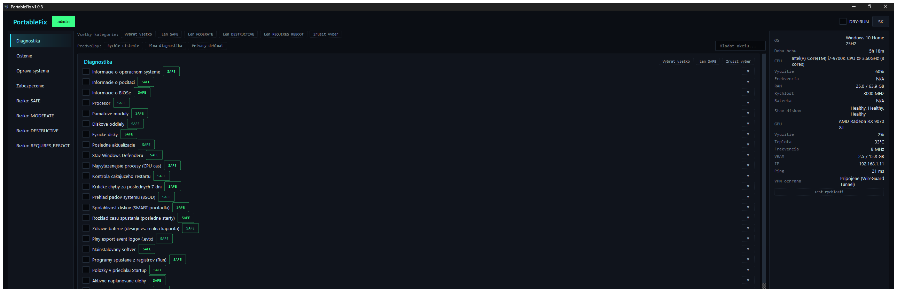

<p align="center">
  
</p>

<h1 align="center">PortableFix</h1>
<p align="center"><i><a href="README.en.md">English version</a></i></p>

<p align="center">
<a href="https://github.com/vxkShelby/portableFixer/actions/workflows/tests.yml"></a>
<a href="https://github.com/vxkShelby/portableFixer/releases/latest"></a>
<a href="https://github.com/vxkShelby/portableFixer/releases"></a>
<a href="https://github.com/vxkShelby/portableFixer"></a>
</p>

Prenosný diagnostický a opravný nástroj pre Windows 10/11, určený na beh
z USB kľúča. Python 3.12 + PySide6 GUI, akcie vykonáva cez PowerShell.

## Náhľad



## Rýchly štart

1. Skopíruj celý priečinok na USB kľúč (alebo spusti priamo z disku).
2. Spusti `PortableFix.cmd` (alebo `python main.py` pri vývoji).
3. Bez admin práv beží aplikácia v režime len-diagnostika; tlačidlom
   **Reštartovať ako administrátor** získaš plný prístup.
4. Zaškrtni akcie, over v **DRY-RUN** režime (predvolene zapnutý), potom
   DRY-RUN vypni a spusti naostro.

## Moduly

| Modul | Kategória | Obsah |
|---|---|---|
| M01 | Diagnostika | Systémové informácie (OS, HW, disky, procesy...), triáž pádov (stop kódy, WHEA, história spoľahlivosti, výpisy pádov) |
| M02 | Čistenie | Temp súbory, cache, kôš, Windows Update cache... |
| M03 | Oprava | Disk: SMART, verdikt zdravia diskov, NTFS scan/SpotFix, TRIM, chkdsk pri reštarte |
| M04 | Oprava | Integrita systému: DISM, SFC, AppX, WMI |
| M05 | Oprava | Windows Update: reset služieb a cache, DLL, detekcia, stav Windows 10 ESU (koniec Consumer ESU 13. 10. 2026) |
| M06 | Oprava | Sieť: DNS, hosts, DHCP, Winsock, TCP/IP |
| M07 | Diagnostika | Autostart: registry Run, Startup, úlohy, služby, WMI, IFEO backdoor, služby bez úvodzoviek, súpis bez položiek Microsoftu (podpis, SHA256) |
| M08 | Zabezpečenie | Defender, firewall, UAC audit + rýchly sken, WPBT disable |
| M09 | Oprava | Tuning: plán napájania, vizuálne efekty, End Task, Sticky Keys, klasické menu, HAGS, Game DVR (úpravy registra s undo na presný pôvodný stav), Storage Sense (prehľad a mesačné čistenie s presným undo) |
| M10 | Diagnostika | Drivery: problémové zariadenia (+ reštart), ovládače tretích strán, sieť/GPU, záloha/obnova |
| M11 | — | Reporting (HTML report po každej dávke, nie katalóg) |
| M12 | Diagnostika | Online: test pripojenia po vrstvách, DNS, proxy |
| M13 | Čistenie | Debloat: telemetria, naplánované úlohy, Fast Startup, reklamy v Exploreri, Recall/Click to Do |
| M14 | Oprava | Tlač: tlačiarne, ovládače a ich triedy (WPP), záloha PrintBRM, kompatibilita SMB/NAS, offline/ghost tlačiarne, reset spooleru |
| M15 | Oprava | Zavádzanie/platforma: BCD, TPM, Secure Boot, verdikt pre Secure Boot certifikáty 2023 (termín 19. 10. 2026), pripravenosť WinRE a Quick Machine Recovery, BitLocker, Bezpečný režim, F8 recovery |
| M16 | Oprava | Office: verzia/kanál, doplnky Outlooku, OST/PST, rýchla/úplná oprava |
| M17 | Oprava | Prehliadače: rozšírenia, policy, únos domovskej stránky, reset profilu |
| M18 | Oprava | Záloha používateľských priečinkov (Desktop/Documents/Pictures/Favorites), záloha na iný disk so SHA-256 manifestom a overením |
| M19 | Oprava | Voliteľné funkcie Windows: prehľad, .NET 3.5, PowerShell v2, Sandbox |
| M20 | Oprava | Aktualizácia softvéru cez winget: zoznam, zastaraný softvér, update all |
| M21 | Oprava | Hardvérové senzory: PawnIO stav/inštalácia (CPU teplota/hodinky cez LibreHardwareMonitor), opotrebenie batérie (verdikt), test pamäte RAM pri reštarte a jeho výsledok |
| M22 | Čistenie | Hlbšie čistenie: osamotené uninstall položky, duplicitné súbory, nefunkčné odkazy (.lnk), bezpečné prepísanie voľného miesta |
| M23 | Antivírus | Microsoft Defender: stav, história hrozieb s verdiktom, aktualizácia definícií, rýchly/úplný/offline sken, výnimky, ochrana pred PUA |

## Funkcie pre technika

- **Predvoľby:** vstavané (Rýchle čistenie, Plná diagnostika, Privacy
  debloat) aj **vlastné** - vyber akcie, klikni **+ Uložiť výber**, pomenuj.
  Vlastné predvoľby sa ukladajú do `Data/settings.json` hneď (nie až pri
  zatvorení), cestujú s USB kľúčom a mažú sa pravým tlačidlom myši.
- **Prehľad (dashboard):** skóre systému po analýze (zelené/oranžové/červené),
  počty nálezov podľa kategórií a **história posledných behov na tomto PC**
  s odkazom na report - pri opakovanej návšteve u toho istého klienta je
  hneď vidno, čo sa robilo minule.
- **HTML report:** v jazyku aplikácie, so súhrnom zlyhaných akcií (odkazy
  priamo na detail), prehľadom podľa modulov/kategórií, filtrom
  (všetky / len zlyhané / len zmeny) a vyhľadávaním. Tlačidlo **Tlačiť /
  uložiť ako PDF** dá čistý biely výtlačok pre klienta. Report je jeden
  samostatný súbor bez internetu. Sekcia **Bezpečnostný záznam** uvádza
  body obnovenia (bod vytvorený panelom odinštalovania, zvyškov v registri
  alebo winget je označený programami, ktoré chránil - všetkými, ak ich
  bolo vybraných viac - a nevydáva sa za bod obnovenia dávky), zálohu registra, odmietnuté chránené programy
  a pokračovanie napriek bežiacemu programu.
- **Balík pre klienta:** tlačidlo **Uložiť balík pre klienta** (v súhrne
  dávky aj pri každom behu v histórii) uloží jeden ZIP
  `PortableFix_<PC>_<run-id>.zip` s HTML/JSON reportom, audit logom,
  `undo.ps1` (ak existuje) a krátkym README (SK+EN) o tom, ako undo
  bezpečne použiť - pripravené na e-mail alebo archív. Obsahuje len súbory
  toho jedného behu (nikdy `Data/settings.json` ani iné behy).
  Voľba **Pribaliť diagnostiku Windows** (predvolene vypnutá, nastavenie sa
  neukladá) pri uložení spustí vstavané reporty Windows a
  vloží ich do priečinka `diagnostics/`: `msinfo32 /nfo` (bez kategórie Načítané moduly), `systeminfo`
  (CSV), `powercfg /batteryreport` (len notebooky, na desktope sa
  preskočí), `dxdiag /t`, `winget export` (ak je winget), kritické
  udalosti a chyby z denníkov System a Application za 7 dní (`wevtutil
  epl`), `driverquery /v` a `ipconfig /all`. Beží na pozadí s priebehom v
  stavovom riadku, každý report má vlastný časový limit a zlyhaný alebo
  zaseknutý report balík nezhodí - len sa zapíše do
  `diagnostics/README.txt`. Nič sa neanonymizuje: README (SK+EN) opisuje
  každý súbor a upozorňuje, že obsahuje osobné údaje (názov PC, mená
  používateľov, sieťové nastavenia). V režime DRY-RUN sa diagnostika
  zbiera tiež (príkazy len čítajú) a konzola aj README to povedia.
  `powercfg /energy` chýba zámerne - trvá minútu a pridá málo.
- **Zákazka** (tlačidlo v hornej lište, Ctrl+J): meno technika (zapamätá
  sa), klient / číslo zákazky a poznámka - zobrazia sa v hlavičke reportu.
- **Redigovať pre klienta** (prepínač v okne Zákazka, predvolene vypnutý,
  pamätá sa): report (HTML aj JSON) a textové súbory balíka pre klienta
  (`report.html`, `report.json`, kópia `audit_log.jsonl`, README) nahradia
  mená používateľov v cestách (`C:\Users\<user>\`) aj mená profilov
  tohto PC kdekoľvek inde (napr. `PC\Jan Novák`), IPv4/IPv6 a MAC
  adresy, sériové čísla (BIOS, disky), časti licenčných kľúčov
  (`XXXXX-XXXXX-…`, `PartialProductKey`) a názvy Wi-Fi sietí (SSID)
  značkami ako `<ip>` či `<serial>`. Názov počítača a údaje zo Zákazky
  zostanú. Verzie s číslom nad 255 (`10.0.26100.1`) alebo s označením
  (`Version : 2.0.0.0`, stĺpec `DriverVersion` v tabuľke), hashe a GUID
  sa nemenia; loopback, masky a verejné DNS (8.8.8.8, 1.1.1.1) tiež nie.
  Neoznačené krátke štvorčíslie (`ovládač 10.1.18.2`) sa zamení za `<ip>`. Report to na začiatku
  viditeľne uvedie („Redigované pre klienta“) a JSON má `"redacted": true`.
  Redaguje sa až pri zápise reportu a pri ukladaní balíka - auditný log
  na USB sa nikdy nemení a v balíku ostáva `undo.ps1` bez zmeny (musí
  vrátiť presné cesty). Vstavané reporty Windows v `diagnostics/` sa
  neredigujú a `diagnostics/README.txt` to povie. Je to maskovanie podľa
  tvaru hodnoty a anglického názvu vlastnosti (`SerialNumber`, `SSID`),
  nie záruka: hodnota bez takého označenia (napr. v stĺpci tabuľky) môže
  ostať.
- **Upozornenie na koniec dávky:** ak je okno v pozadí (napr. počas
  dlhého DISM/SFC), bliká na paneli úloh a zobrazí systémovú notifikáciu
  s počtom OK/zlyhaných akcií.
- **Klávesové skratky:** F5 spustiť, Ctrl+A vybrať všetko, Ctrl+F hľadať,
  Esc vymazať hľadanie, Ctrl+S uložiť predvoľbu, Ctrl+J zákazka, F1 prehľad.
- **Odinštalovanie programov a winget aktualizácie:** tieto panely
  rešpektujú DRY-RUN (len vypíšu príkazy), pred akoukoľvek zmenou sa
  opýtajú a každý program, balík aj vymazaný zvyšok v registri (ten sa
  pred vymazaním zálohuje do `Backups/<run-id>/*.reg`) sa zapíše do
  audit logu. Pred ostrým odinštalovaním, aktualizáciou aj čistením
  zvyškov sa vytvorí bod obnovenia (rovnako ako pri dávke, vrátane
  otázky pri jeho zlyhaní). Kým beží dávka akcií, panely ostré
  odinštalovanie ani aktualizáciu nespustia (dva body obnovenia naraz
  by si prepísali nastavenie limitu), a ak sa počas vytvárania bodu
  zapne DRY-RUN, zmena sa už nevykoná. Ak odinštalovaný alebo aktualizovaný program
  práve beží (podľa cesty k spustenému súboru), panel ho vymenuje a
  požiada o zatvorenie: Retry skontroluje znova, Ignore pokračuje
  (zapíše sa), Cancel nič nezmení.
- **Chránené programy:** Uninstaller odmietne odinštalovať ovládače
  grafiky, zvuku a čipovej sady (NVIDIA, AMD, Intel, Realtek), runtime
  WebView2, súčasti Windows (Store, winget, Zabezpečenie Windows) a
  samotný nainštalovaný PortableFix. Riadok ukáže značku „chránené“ s
  dôvodom a nedá sa zaškrtnúť. Zoznam je zámerne krátky: antivírus,
  RMM agent či Visual C++ runtime technik bežne vymieňa, tie chránené
  nie sú. Rozpoznáva sa podľa vydavateľa, názvu produktu a kľúča v
  registri, nie podľa preložených textov.
- **Winget panel nikdy neklame „všetko aktuálne“:** ak winget chýba
  alebo sa nedá spustiť (nie je Inštalátor aplikácií, nie je
  zaregistrovaný pre účet, chýbajú mu závislosti), panel to napíše aj
  s radou, čo robiť. Zlyhaná kontrola ukáže kód chyby winget v hex
  tvare (napr. `0x8A15004B`) a pri poškodených zdrojoch odporučí akciu
  „Reset zdrojov balíkov (winget)“. Zoznam sa číta bez ohľadu na jazyk
  Windows – cez modul Microsoft.WinGet.Client, ak je nainštalovaný,
  inak z tabuľky `winget upgrade` podľa jej štruktúry, nie podľa
  (preložených) nadpisov stĺpcov. Ak sa niektorý riadok tabuľky
  nedá prečítať, panel ukáže zvyšok a upozorní, že zoznam nie je
  úplný. Winget mimo PATH (napr. v zvýšenej
  relácii) sa nájde aj v priečinku WindowsApps.
- **Triáž pádov (M01):** štyri akcie len na čítanie, ktoré treba spustiť
  pred akýmkoľvek čistením. *Triáž pádov* prejde log System za 90 dní
  (BugCheck 1001, Kernel-Power 41, EventLog 6008) a ku každému pádu
  vypíše stop kód s parametrami, cestu k dumpu a zo vstavanej tabuľky
  ~35 najčastejších kódov aj názov a pravdepodobnú príčinu. Súhrn podľa
  stop kódu počíta pády, nie udalosti: udalosti do 10 minút od seba
  (najviac jedna z každého druhu) sú jeden pád. *Hardvérové
  chyby WHEA* zhrnú chyby PCI Express, procesora a pamäte za 30 dní podľa
  súčasti a počtu. *História spoľahlivosti* ukáže index stability 1–10
  s trendom a najčastejšie padajúce programy. *Výpisy pádov ako dôkaz*
  vypíšu Minidump, MEMORY.DMP a LiveKernelReports s veľkosťou a dátumom
  a pri každom súbore povedia, či ho čistenie „Výpisy pádov systému“
  zmaže (maže len predvolené umiestnenia Windows, nie vlastný priečinok
  z CrashControl, a prehľadajú ich vždy) - preto si ich najprv skopírujte. Údaje sa čítajú z event ID, názvov providerov, XML udalostí
  a tried CIM, nikdy z preloženého textu správ, takže fungujú v každom
  jazyku Windows. Triáž pádov a hardvérové chyby WHEA sú aj v predvoľbe
  Plná diagnostika.
- **Prehliadače vo všetkých profiloch (M02, M17):** *Cache prehliadačov*
  čistí všetky profily (Default, Profile N, Guest Profile... - každý
  priečinok v `User Data` so súborom `Preferences`) prehliadačov Chrome,
  Edge, Brave, Vivaldi, Opera a Opera GX (Opera má profil priamo
  v `%APPDATA%\Opera Software\Opera Stable`, ďalšie profily
  v `_side_profiles`, HTTP cache v rovnakej ceste pod `%LOCALAPPDATA%`)
  a všetky profily Firefoxu. Maže len obsah priečinkov `Cache`,
  `Code Cache`, `GPUCache`, `Service Worker\CacheStorage` a `ScriptCache`,
  nikdy cookies, heslá, históriu, záložky ani rozšírenia. Prehliadač,
  ktorý beží, preskočí a vypíše (nikdy ho nezatvára), cez junction ani
  symlink nejde a pri každom profile vypíše uvoľnené MB; DRY-RUN vypíše,
  čo by vyčistil. Rovnaký zoznam profilov používa *Prehľad rozšírení*
  aj *Kontrola domovskej stránky a vyhľadávania* (pribudla URL
  vyhľadávača a stránky pri štarte), takže únos v „Profile 2“ alebo
  v Brave už neujde. *Reset profilu Chrome/Edge* prehliadač už nezatvára:
  ak beží, odmietne pokračovať a nič nezmení - klient by inak prišiel
  o otvorené karty a rozpísané formuláre.
- **Batéria a RAM (M21):** *Opotrebenie batérie* (SAFE) číta
  `powercfg /batteryreport /XML` do dočasného súboru v `%TEMP%`, ktorý
  hneď zmaže. Pre každú batériu vypíše menovitú a plnú kapacitu, zdravie
  v % a počet cyklov. Verdikt: GOOD nad 80 %, CAUTION 60 - 80 %,
  REPLACE pod 60 %. Pri viacerých batériách rozhoduje najhoršia.
  Stolný počítač dostane NO BATTERY a firmvér bez kapacít UNKNOWN;
  plná kapacita 0 pri platnej menovitej často znamená mŕtvu batériu
  a výpis na to upozorní.
  *Naplánovanie testu pamäte RAM pri reštarte* (REQUIRES_REBOOT, nie je
  vo „Vybrať všetko“) robí to isté ako mdsched.exe, ale bez dialógu:
  `bcdedit /bootsequence {memdiag}` nastaví jednorazový štart Windows
  Memory Diagnostic. **PC sa nereštartuje** - reštartuješ ho, keď sa to
  hodí klientovi. Zvyšok dávky na test nečaká. Úspech hlási, len ak
  položka `{memdiag}` existuje, bcdedit skončil s kódom 0 a (ak sa dá
  prečítať hive BCD) jednorazová sekvencia naozaj obsahuje GUID
  `{memdiag}`. Undo zruší test, ktorý ešte nebežal. *Výsledok testu
  pamäte RAM* (SAFE) prečíta posledný výsledok zo systémového denníka
  podľa event ID providera `Microsoft-Windows-MemoryDiagnostics-Results`
  (1101/1201 bez chýb, 1102/1202 chyby, 1103 zrušený, 1104 nedokončený)
  s dátumom a verdiktom PASS / FAIL / INCOMPLETE / NEVER RUN. Nič sa
  nečíta z preloženého textu.
- **Microsoft Defender (M23):** *História hrozieb Defenderu* (SAFE)
  vypíše detekcie za 90 dní (počet aj za 30 dní) - názov hrozby,
  závažnosť, stav, vykonaný zásah, dotknuté súbory, čas - a aktuálny stav
  ochrany (ochrana v reálnom čase, ochrana pred zmenami, vek definícií,
  verzie enginu a produktu, posledný rýchly a úplný sken) s jedným
  riadkom `VERDICT:` (OK / WARNING / ATTENTION / NOT ACTIVE / NOT
  AVAILABLE). *Úplný sken* beží ako úloha na pozadí a každú minútu
  vypíše priebeh; trvá zvyčajne 1 - 3 hodiny a limit akcie je 8 hodín.
  *Offline sken* (REQUIRES_REBOOT, nie je vo „Vybrať všetko“) najprv
  aktualizuje definície, ukáže ID kľúča BitLocker a potom **okamžite
  reštartuje** PC do Microsoft Defender Offline. V dávke beží vždy ako
  posledný, až po zapísaní reportu a `undo.ps1` (pozri *Dávka cez
  reštart*); pred ostrým spustením ulož rozrobenú prácu. *Zapnutie ochrany pred PUA* uloží predošlú
  hodnotu do `%ProgramData%\PortableFix` (priečinok len pre
  administrátorov) a undo ju obnoví. Ak Defender nahradil iný antivírus,
  akcie to zistia z `Get-MpComputerStatus` (AMRunningMode, príznaky
  služby, HRESULT chyby), nikdy podľa preloženého textu: skeny a zmena
  PUA odmietnu bežať s nenulovým kódom a vysvetlením, história hrozieb
  vypíše verdikt NOT ACTIVE - alebo ATTENTION, ak Defender aj tak
  zaznamenal neodstránené či stále aktívne hrozby.
- **Windows 10 ESU (M05):** *Windows 10 ESU - stav a verdikt* (SAFE)
  prečíta stav zápisu do Consumer ESU (`ESUEligibility` a
  `ESUEligibilityResult` v HKCU aj HKLM; čísla mimo verejne známeho
  dekódovania vypíše ako Unknown), vek poslednej kumulatívnej
  aktualizácie zo servisného zásobníka (balíky RollupFix, záloha cez
  históriu Windows Update; viac ako 45 dní = nezáplatované), prítomnosť
  agenta 0patch a build s UBR. Samotný dátum nestačí - reinštalácia, reset
  či opravný upgrade nainštalujú októbrovú aktualizáciu z roku 2025 s
  čerstvým dátumom; build 19045 s UBR najviac 6456 (posledná verejná
  aktualizácia z 14. 10. 2025) preto nikdy nie je PATCHED, lebo žiadna ESU
  aktualizácia neprišla. Riadok `VERDICT:` (OK / ACTION NEEDED /
  PATCHED / UNPATCHED / UNKNOWN / NOT APPLICABLE) nasledujú možnosti:
  upgrade na Windows 11, ESU (Consumer ESU podľa Microsoftu končí
  13. 10. 2026) alebo nové PC. Na Windows 11 oznámi, že ESU sa ho netýka.
- **Storage Sense (M09):** *Storage Sense - prehľad nastavení* (SAFE)
  dekóduje hodnoty `StoragePolicy` v HKCU (zapnuté, kadencia, dočasné
  súbory, kôš, Stiahnuté a počty dní; nezdokumentované hodnoty vypíše ako
  neznáme) aj politiky, ktoré ich prebíjajú. *Storage Sense - zapnúť
  mesačné čistenie* (MODERATE) nastaví mesačný beh, mazanie dočasných
  súborov a súborov v koši starších ako 30 dní, Stiahnuté nechá vypnuté.
  PC tak zostane čisté aj po odchode technika bez akéhokoľvek agenta.
  Presné predošlé hodnoty (typ, hodnotu aj to, či existovali) uloží do
  `%ProgramData%\PortableFix\storage_sense_backup.json` a undo ich presne
  obnoví, hodnoty, ktoré predtým neexistovali, zmaže; bez zálohy undo
  odmietne bežať. Opakované zapnutie ponechá prvú zálohu toho istého
  používateľa, takže undo vráti pôvodný stav. **HKCU je hive
  používateľa, pod ktorým PortableFix beží** - obe akcie (aj ESU) vypíšu jeho meno a SID a upozornia, ak je
  prihlásený iný používateľ (technik zvýšil práva vlastným účtom).
- **Tlač (M14):** *Triedy ovládačov tlačiarní a pripravenosť na WPP*
  (SAFE) vypíše pri každom ovládači typ (Type 3 / Type 4), verziu,
  výrobcu, izoláciu a tlačiarne, ktoré ho používajú. Pri každej tlačiarni
  ukáže port (monitor, adresu) a či je pripravená na Windows Protected
  Print, teda či používa inbox IPP class driver (Mopria) alebo Microsoft
  Print To PDF - ovládače od Microsoftu pre konkrétne zariadenia (PCL6
  class driver, Generic / Text Only) pod WPP nefungujú. Riadok
  `VERDICT:` povie, koľko tlačiarní nie je pripravených a koľko z nich
  závisí od ovládačov tretích strán - tie od júla 2027 dostávajú už len
  bezpečnostné opravy. *Záloha
  tlačiarní, ovládačov a portov (PrintBRM)* (MODERATE) uloží všetko
  nástrojom `PrintBrm.exe -B` do
  `%ProgramData%\PortableFix\printer_backups\<dátum_čas>.printerExport`
  (priečinok len pre administrátorov) a vypíše príkaz na obnovu
  `PrintBrm.exe -R -F <súbor>`. Automatické undo nemá - obnovu spustí
  technik sám. Spustite ju pred odstránením ovládačov alebo resetom
  tlačového systému. *Kompatibilita SMB a zdieľanej tlače* (SAFE) pri
  nefunkčnom starom NAS alebo zdieľanej tlačiarni vypíše SMB1 (klient
  aj server), povinné podpisovanie, prihlásenie hosťa, ochranu
  tlačového RPC (`RpcAuthnLevelPrivacyEnabled`, RPC politiky) a
  inštaláciu ovládačov z tlačových serverov. Ku každému vysvetlí, čo
  staré zariadenie potrebuje, a verdikt SECURE / WEAKENED povie, či je
  niektorá ochrana oslabená (WEAK DEFAULT: nikto nič neoslabil, ale
  predvolené prihlásenie hosťa pred Windows 11 24H2 je slabšie, než sa
  odporúča). Nič nemení a bezpečnosť nikdy neznižuje.
  Keď Zaraďovač tlače nebeží, prehľad ovládačov aj záloha skončia s
  chybou a vysvetlením a SMB prehľad to uvedie. Všetko sa číta z
  cmdletov, registrov a kódov, nikdy z preloženého textu.
- **Záloha dát klienta na iný disk (M18):** *Záloha dát používateľa na
  iný disk* (MODERATE, nie je vo „Vybrať všetko“) kopíruje Desktop,
  Documents, Pictures, Downloads a Favorites aktuálneho používateľa
  (aj presmerované do OneDrive) a záložky Chrome, Edge, Brave a Firefox
  na disk, z ktorého beží PortableFix, do
  `PortableFix_Backups\<POČÍTAČ>_<čas>\Files`. Cieľ sa neberie
  z dialógu: je to disk aktuálneho priečinka procesu, ktorý zabalená appka pri
  štarte nastaví na svoj koreň - preto PortableFix spúšťajte z externého
  disku. Akcia odmietne systémový disk, inú partíciu toho istého
  fyzického disku, cestu bez písmena disku a disk bez dostatku voľného
  miesta (odhad + 256 MB). Kopíruje `robocopy /E /COPY:DAT /R:1 /W:1
  /XJ /XA:O` (nikdy nevojde do junction, nesťahuje súbory OneDrive,
  ktoré sú len online), exit kód 0 - 7 berie ako úspech, 8+ ako chybu.
  Potom zapíše `manifest-sha256.csv` (relatívna cesta, veľkosť,
  SHA-256), SHA-256 manifestu vypíše do reportu a výsledok behu uloží
  do `backup-status.txt`; ak je v manifeste menej súborov ako v odhade,
  vypíše WARN (robocopy mohol potichu vynechať priečinok). Na zdroji nič
  nemaže. Zálohuje sa profil
  účtu, pod ktorým appka beží. *Overenie zálohy na inom disku* (SAFE)
  znova zahashuje najnovšiu zálohu tohto PC a vypíše chýbajúce,
  zmenené a nečitateľné súbory s verdiktom OK / FAIL; bez zálohy
  (NO BACKUP) tiež skončí chybou. *Zoznam
  existujúcich záloh* ukáže aj zálohy na disku PortableFix. Záloha nie
  je šifrovaná a súbor nad 4 GB sa na FAT32 nezmestí (záloha skončí
  ako INCOMPLETE). Kontrola toho istého fyzického disku nerozpozná
  písmeno SUBST ani pripojený VHD(X) uložený na systémovom disku.
- **Autoštart bez položiek Microsoftu** (M07, SAFE): jeden súpis
  všetkých miest autoštartu - Run/RunOnce, Startup, naplánované úlohy,
  služby a ovládače (pri svchost aj ServiceDll), Winlogon, AppInit_DLLs,
  balíčky LSA, monitory tlače, Winsock, BootExecute, IFEO a Active Setup.
  Pri každej položke nájde skutočný súbor (úvodzovky, argumenty,
  `rundll32 x.dll,Vstup`, `%premenné%`, cesty k System32), zistí podpis
  Authenticode s podpisovateľom, SHA256 a čas zmeny. Položky podpísané
  Microsoftom skryje (podpis musí byť platný a certifikát aj jeho vydavateľ
  Microsoftu, alebo `IsOSBinary`); IFEO presmerovania, skriptovacích
  hostiteľov a spúšťače (powershell.exe, cmd.exe, wscript.exe, conhost.exe...)
  a ovládače tretích strán podpísané cez WHQL ukáže vždy; rundll32,
  regsvr32, msiexec a podobných hostiteľov vtedy, keď argumenty ukazujú
  na súbor mimo priečinka Windows alebo na sieť (poznámka uvedie súbor a
  jeho podpis). Pri 32-bitových AppInit_DLLs a Winsock hľadá súbor v
  SysWOW64. Ostatné
  vypíše so stabilným ID `AR-xxxxxxxxxxxx` (hash miesta, názvu a príkazu),
  najprv s neplatným podpisom a nepodpísané, potom chýbajúce súbory, s
  počtami podľa kategórie a riadkom `SUMMARY`. Podpis sa overuje raz na
  súbor, súbory nad 200 MB sa nehašujú. Nepodpísaný súbor v priečinku
  Windows môže byť podpísaný katalógom, ak nebeží služba CryptSvc - pri
  položke je poznámka. Nič nemení; vypínanie položiek príde neskôr.

## Bezpečnostné mechanizmy

- **Úrovne rizika:** každá akcia je označená SAFE / MODERATE /
  DESTRUCTIVE / REQUIRES_REBOOT. MODERATE a vyššie vyžadujú potvrdenie,
  DESTRUCTIVE má osobitné varovanie o nevratnosti.
- **Kontrola pred spustením:** ostrá dávka s akciou MODERATE alebo vyššou
  ukáže jednu obrazovku namiesto otázky pri každej akcii. Vidno na nej
  všetky vybrané akcie s úrovňou rizika a textom varovania, či vznikne
  bod obnovenia, čo sa nedá vrátiť a čo vyžaduje reštart. Každú
  DESTRUCTIVE akciu treba osobitne odškrtnúť („Rozumiem, je to
  nevratné“), inak sa nespustí. Jedno potvrdenie pokryje celú dávku a
  audit log pri každej akcii zapíše presný text, ktorý technik potvrdil
  (alebo odmietol).
- **Dávka cez reštart:** akcia, ktorá PC reštartuje okamžite
  (`restarts_pc: true` v `actions.yaml`, dnes *Offline sken* Defendera),
  beží v dávke vždy posledná. Pred ňou sa zapíše audit log (udalosť
  `restart_pending`), `undo.ps1` aj HTML report, takže záznam ostane,
  aj keď sa PC hneď reštartuje. Akcia, ktorej zmenu dokončí až reštart
  a ďalšie akcie by bežali proti rozpracovanému stavu
  (`restart_before_next: true`: *Plná kontrola disku pri reštarte* a
  *Odinštalovanie poslednej aktualizácie*), po úspechu dávku zastaví.
  *Plná kontrola disku pri reštarte* hlási úspech, len ak je kontrola
  naozaj naplánovaná (dirty bit zväzku alebo záznam `autochk` pre disk
  v `BootExecute`), inak zlyhá a dávka pokračuje bez reštartu.
  Zvyšok dávky (id akcií, run_id, DRY-RUN, údaje o zákazke, kroky
  `undo.ps1`) sa uloží do `Data/pending_batch.json` a PortableFix
  povie, že treba reštartovať. Kroky `undo.ps1` z ďalších dávok v tom
  istom okne pred reštartom sa do súboru dopisujú, aby o ne pokračovanie
  neprišlo; zálohy registrov sa ukladajú relatívne k priečinku
  PortableFix, takže ich nájde aj pri inom písmene USB (chýbajúcu
  zálohu ohlási). Ak sa pri pokračovaní prepne DRY-RUN na režim prvej
  časti dávky, kontrolná obrazovka to povie. Pri ďalšom spustení PortableFix ponúkne
  pokračovanie: súhlas označí zvyšné akcie a znova otvorí kontrolnú
  obrazovku (aj pri dávke len zo SAFE akcií), odmietnutie uloženú dávku
  zahodí. Pokračovanie používa rovnaký run_id, takže audit log, report
  aj `undo.ps1` sú pre celú zákazku jedny. Súbor starší ako 24 hodín
  alebo z iného počítača sa zmaže bez otázky. PortableFix nič
  neregistruje na automatické spustenie s Windows - po reštarte ho
  technik spustí sám. Kontrolná obrazovka vopred vypíše, ktorá akcia
  pobeží posledná a ktoré akcie počkajú na reštart. Bezpečnostný záznam
  reportu to uvedie v jazyku reportu a s názvami akcií: reštart a čo sa
  uložilo na pokračovanie (alebo že sa uložiť nepodarilo), pokračovanie
  po reštarte, akcie vynechané pre chýbajúci katalóg, odmietnuté
  pokračovanie a chýbajúcu zálohu registra z prvej časti.
- **PC neuspí počas dávky:** kým beží dávka (vrátane zápisu reportu),
  PortableFix cez `SetThreadExecutionState` bráni uspaniu systému
  (obrazovka sa môže vypnúť). Po dávke alebo pri zatvorení okna sa
  nastavenie hneď vráti.
- **Pre-flight kontrola:** pred ostrou dávkou, ktorá mení systém, sa
  overí stav PC. **Blokuje:** iná úloha PortableFix práve mení systém
  (winget, odinštalovanie, aktualizácia), chýbajúce admin práva pre
  akcie meniace systém, čakajúci reštart Windows Update alebo
  servisovania súčastí pred opravami, menej ako 5 GB voľného miesta na
  systémovom disku a batéria pod 30 % pri dlhých akciách alebo akciách
  s reštartom. **Upozorní:** beh na batériu, menej ako 10 GB voľného
  miesta, čakajúce premenovanie súborov. Blokovanie (okrem inej bežiacej
  úlohy) sa dá vedome obísť zaškrtnutím, obídenie sa zapíše do audit
  logu a reportu.
- **Najprv image - brána zdravia disku:** akcie, ktoré disk silno
  zaťažia, majú v `actions.yaml` pole `stresses_disk: true` (M03: plná
  kontrola `chkdsk /f /r` pri reštarte, optimalizácia
  TRIM/defragmentácia, online oprava SpotFix; M22: bezpečné prepísanie
  voľného miesta `cipher /w`). Keď je taká akcia v ostrej dávke,
  pre-flight raz, pri otvorení kontrolnej obrazovky, spustí rovnaký
  skript ako SAFE akcia **Zdravie diskov - verdikt** (jedno spustenie
  PowerShellu s limitom 20 s, na pozadí - okno počas neho reaguje a
  tlačidlo „Zrušiť dávku“ dávku zruší a zapíše to do audit logu). Ak systémový disk hlási FAILING alebo
  WARNING, zobrazí sa blokovanie „najprv zálohujte alebo vytvorte image
  disku“, ktoré sa dá obísť len vedomým zaškrtnutím a obídenie sa zapíše
  do audit logu. Keď systémový disk nevieme určiť, rozhoduje najhorší
  disk. UNKNOWN (VM, USB adaptér, chýbajúce práva) ani zlyhanie sondy
  nikdy neblokujú. SFC a DISM príznak nemajú: čítajú len súbory Windows
  (niekoľko GB, podobne ako bežná aktualizácia) a blokovanie by
  zastavilo väčšinu opráv aj na opotrebovanom, no funkčnom SSD.
- **Zdravie diskov - verdikt (M03, SAFE):** pre každý fyzický disk
  vypíše `Get-PhysicalDisk` (HealthStatus, OperationalStatus,
  MediaType, BusType), `Get-StorageReliabilityCounter` (opotrebovanie,
  teplota, neopravené chyby čítania, hodiny prevádzky, ak sú
  čitateľné) a SMART predpoveď zlyhania z `root\wmi`
  `MSStorageDriver_FailurePredictStatus`. Na konci je pre každý disk
  jeden riadok `VERDICT:` so stavom OK, WARNING, FAILING alebo UNKNOWN
  a kódmi pravidiel, ktoré rozhodli. **FAILING:** HealthStatus
  Unhealthy, OperationalStatus Predictive Failure / Error /
  Non-Recoverable Error alebo PredictFailure. **WARNING:** HealthStatus
  Warning, stav Degraded / Stressed, neopravené chyby čítania alebo
  opotrebovanie od 90 %. Rozhodujú len číselné hodnoty a názvy enumov
  CIM, nikdy lokalizovaný text.
- **DRY-RUN:** predvolene zapnutý — akcie sa len vypíšu (alebo spustia
  read-only náhľad), nič sa nemení. Preto sa v DRY-RUN nič nepotvrdzuje
  a pre-flight kontrola ani bod obnovenia sa nerobia.
- **Bod obnovenia:** raz za dávku, pred prvou akciou, ktorá **mení
  systém**, sa vytvorí System Restore Point na systémovom disku
  (best-effort; pri zlyhaní sa aplikácia opýta, či pokračovať).
  Rozhoduje účinok akcie, nie kategória modulu: DESTRUCTIVE vždy;
  inak pole `changes_system: true/false` v `actions.yaml`, ak ho akcia
  má; inak MODERATE / REQUIRES_REBOOT áno a SAFE nie. Čisto
  diagnostické kontroly tak bod obnovenia nikdy nespustia a debloat
  z M13 (MODERATE zmeny registra, odstránenie OneDrive) ho už má.
  `changes_system: false` majú akcie, ktorých účinok bod obnovenia
  nevie vrátiť (Kôš, cache prehliadačov a písiem, výpisy pádov,
  prepis voľného miesta, aktualizácia a sken Defendera), SAFE akcia,
  ktorá mení stav systému, musí mať `changes_system: true` (stráži to
  test katalógu). Windowsový 24-hodinový limit na vytváranie bodov
  obnovenia sa na tento jeden bod dočasne zruší a pôvodné nastavenie
  sa hneď obnoví - predtým Windows bod potichu preskočil a dávka
  bežala bez neho. Dávka len zo SAFE akcií, ktoré systém nemenia,
  nemá bod obnovenia ani pre-flight kontrolu, a preto môže bežať aj
  popri odinštalovaní či winget aktualizácii.
- **Úplná záloha registra (voliteľná):** pri dávke s DESTRUCTIVE
  akciou ponúkne kontrolná obrazovka (nezaškrtnuté) aj `reg save`
  HKLM\SOFTWARE a HKLM\SYSTEM s odhadom veľkosti. Záloha sa uloží
  do `Backups/<run-id>/hives-<čas>/` tesne pred prvou DESTRUCTIVE
  akciou, zapíše sa do audit logu a reportu a `undo.ps1` uvedie
  priečinok s postupom ručnej obnovy offline (WinRE). PortableFix ju
  nikdy neobnoví sám - vrátila by všetky zmeny registra od zálohy, nielen
  tie jeho. Ak sa záloha nepodarí, aplikácia sa opýta, či DESTRUCTIVE
  akcie spustiť aj bez nej. Priečinok obsahuje celý register klienta
  vrátane uložených hesiel (napr. automatického prihlásenia) a boot
  kľúča - po zákazke ho zmažte alebo odovzdajte klientovi.
- **undo.ps1:** akcie s vratným účinkom (napr. reset hosts súboru,
  zastavenie služieb, zmena plánu napájania) priebežne zapisujú svoje
  undo príkazy do `Backups/<run-id>/undo.ps1` — v opačnom (LIFO)
  poradí, takže skript sa dá spustiť ako celok. Zapisuje sa po každej
  úspešnej akcii, takže aj pri páde aplikácie súbor odráža reálny stav.
- **Undo na presný pôvodný stav (deklaratívne `ops:`):** akcia v
  `actions.yaml` môže namiesto ručne písaného `command` uviesť zoznam
  operácií - `reg_set {path, name, type, value}`, `reg_delete {path,
  name}`, `service_start_type {name, start_type}` (`automatic`,
  `automatic_delayed`, `manual`, `disabled`) a `task_state {path,
  enabled}` - a voliteľne `ops_message`. PortableFix z nich vygeneruje
  príkaz, ktorý pred prvou zmenou zachytí živý stav (hodnotu aj typ,
  alebo že hodnota či kľúč neexistovali; typ štartu služby; či je úloha
  zapnutá) do `Backups/<run-id>/state/<akcia>.json` a až potom zmeny
  urobí. Undo sa po behu vygeneruje z tohto záznamu a vráti presne
  predošlý stav: hodnoty, ktoré predtým neexistovali, zmaže a kľúče,
  ktoré akcia vytvorila, odstráni (len ak sú prázdne). Zapíše sa aj
  vtedy, keď akcia zlyhá uprostred, takže vráti aj to, čo sa stihlo
  zmeniť. Náhľad v DRY-RUN („zmenilo by X z <teraz> na <nové>“) vzniká
  automaticky. Pri HKCU sa uloží SID používateľa a undo spustené pod iným
  používateľom tieto hodnoty preskočí. Cesty a názvy musia prejsť
  prísnymi pravidlami (len hive HKLM, HKCU, HKU, HKCR, žiadne zástupné
  znaky) a hodnoty sa do PowerShellu dostanú len ako literály; chybné
  `ops` zastavia načítanie modulu s presnou chybou. Takto sú prepísané
  registrové úpravy M09 (vizuálne efekty, End Task, Sticky Keys,
  klasické menu, HAGS, priorita popredia, Game DVR); ich undo predtým
  zapisovalo pevné predvolené hodnoty Windows alebo jedinú zálohu v
  `%ProgramData%`.
- **Audit log + report:** každá akcia sa zapisuje do
  `Logs/<run-id>/audit.jsonl` a po každej dávke sa generuje HTML report
  do `Reports/`.
- **Auto-update:** pri behu ako zbalený `.exe` appka pri štarte ticho
  skontroluje GitHub Releases (`vxkShelby/portableFixer`); ak existuje
  novšia verzia, zobrazí dismissovateľný banner s ponukou stiahnuť a
  aplikovať. Sťahovanie beží na pozadí a nahradí celý balík (`App/`,
  `Modules/`, `Vendor/`, `PortableFix.cmd`) - `Data/settings.json`
  (jazyk, dry-run) sa zachová. Pri zlyhaní kontroly aktualizácií
  (offline, timeout) je ticho — nič nevypíše. Stiahnutý balík sa ešte
  pred zatvorením appky rozbalí vedľa inštalácie (`_update_stage`) a
  overí (štruktúra, voľné miesto, `Data/SHA256SUMS`); appka sa zavrie až
  vtedy, keď aktualizačný skript potvrdí, že naozaj beží. Ak sa to
  nepodarí, appka zostane otvorená a ukáže dôvod (napr. kód ukončenia
  PowerShellu a koniec jeho výstupu), priečinok s logmi a odkaz na ručné
  stiahnutie; pripravená aktualizácia zostane, takže ďalší pokus už nič
  nesťahuje. Kým beží dávka, zápis reportu, test rýchlosti, winget,
  odinštalovanie programov alebo vytváranie bodu obnovenia, appka
  odovzdanie aktualizácie odmietne a povie prečo. Zatvorenie appky počas sťahovania ho čisto preruší. Po
  aktualizácii sa appka spustí sama; kým aktualizácia beží, ručne
  spustená appka iba oznámi, že sa práve aktualizuje. Záznamy
  o aktualizácii sú v `%TEMP%\PortableFixUpdate` (`update_log_<pid>.txt`,
  `launch_<pid>.txt`) - čistenie temp súborov (`user_temp`) ich
  nemaže; staršie ako 14 dní appka pri štarte odstráni.
- **Tichý režim (bez siete na pozadí):** prepínač nad panelom
  systémových informácií, uložený v `Data/settings.json`
  (`quiet_mode`, predvolene vypnutý). Keď je zapnutý, appka sama od
  seba nekontaktuje sieť: vypne ping na 8.8.8.8 každé 4 s, kontrolu
  VPN (powershell.exe každých 60 s), kontrolu aktualizácií na GitHube
  pri štarte aj automatickú kontrolu winget. Hodí sa na firemnej sieti
  klienta, kde by opakovaný ping mohol spustiť alarm EDR. Ručné
  tlačidlá fungujú ďalej a sieť kontaktujú len po kliknutí:
  „Skontrolovať ping a VPN teraz“, „Skontrolovať aktualizácie“, „Test
  rýchlosti“ a „Obnoviť“ vo winget paneli. Stav režimu je vpravo
  v stavovom riadku. Po vypnutí režimu appka dobehne vynechanú kontrolu
  aktualizácií aj winget. Nezávisle od režimu sa pri minimalizovanom
  okne zastaví všetok polling panelu (CPU, RAM, senzory, ping, VPN)
  aj automatická kontrola winget a po obnovení okna sa hneď obnoví.
- **Ochrana pred zmazaním vlastných súborov:** akcie čistiace `%TEMP%`
  a `%WINDIR%\Temp` (`user_temp`, `system_temp`) rozpoznajú, ak appka
  beží zvnútra tohto priečinka, a jej priečinok vynechajú - ak sa to
  nedá bezpečne určiť (appka JE `%TEMP%`, alebo je presmerovaný cez
  junction/symlink), akcia sa radšej vôbec nespustí a appka to oznámi.
  Appka pri štarte tiež zaloguje vlastné cesty, a počas behu dávky
  kontroluje, či jej priečinok medzičasom nezmizol - ak áno, dávku
  okamžite zastaví namiesto tichého pokračovania.
- **Mazanie nejde cez junction ani symlink:** čistenie temp priečinkov,
  cache, Windows.old, zvyškov po upgrade, starých záloh Windows Update
  a tlačového frontu prechádza strom samo a junction, symlink či iný
  reparse point zmaže iba ako odkaz - nikdy nevojde dovnútra. Používateľ
  bez admin práv tak nemôže podstrčiť odkaz napr. na `C:\Windows\System32`
  a nechať ho vymazať zvýšeným čistením (trieda chyby CVE-2026-55567).
  Ak je odkazom samotný čistený priečinok (napr. podstrčený `C:\NVIDIA`),
  zmaže sa len odkaz a `takeown`/`icacls` sa nad ním nespustia.
  Odstránenie Windows.old a zvyškov po upgrade mení vlastníka a práva
  po jednom priečinku (nikdy rekurzívne cez odkaz) a len ak priečinok
  vlastní SYSTEM, TrustedInstaller alebo Administrators. Priečinok, ktorý
  vlastní bežný používateľ (mohol ho vytvoriť aj s odkazmi vnútri), akcia
  odmietne: nič nezmení ani nezmaže a skončí chybou. Podpriečinky
  používateľa (napr. starý profil) nechá s pôvodným vlastníkom a právami.
  Na veľkom Windows.old to môže trvať aj hodinu - akcia priebežne vypisuje
  postup. Aktualizácia PortableFix maže staré zálohy priečinkov tým istým
  spôsobom, bez prechodu cez odkaz.

## Keď aktualizácia zlyhá

Každý pokus o aktualizáciu zanechá záznamy v `%TEMP%\PortableFixUpdate`
(Win+R → `%TEMP%\PortableFixUpdate`); `<pid>` je číslo procesu appky,
ktorá aktualizáciu spustila:

- `launch_<pid>.txt` - ako appka spustila aktualizátor: na ktoré procesy
  čaká, použitý spôsob spustenia, údaje o Job Objecte, výsledok a kód
  ukončenia PowerShellu;
- `popen_launch_<pid>.log` - čo PowerShell vypísal pred spustením
  aktualizačného skriptu alebo namiesto neho (blokovanie politikou, chyba);
- `update_log_<pid>.txt` - kroky samotného aktualizátora: čakanie na
  zatvorenie appky, každý presun priečinka, výsledok a opätovné spustenie;
- `swap_<pid>_*.ps1` a `.json` - skript a úloha, ktorú vykonal.

Výsledok poslednej aktualizácie je aj v `Data\update_status.txt` vedľa
appky, kým ho neprečíta ďalšie spustenie. Pri hlásení problému zbaľ celý
priečinok `%TEMP%\PortableFixUpdate` (a `Data\update_status.txt`, ak tam
ešte je) do ZIP a prilož ho k
[issue na GitHube](https://github.com/vxkShelby/portableFixer/issues/new).
Appka reštartovaná ako administrátor pod iným účtom zapisuje do `%TEMP%`
toho účtu.

Verzie 1.11.4 a staršie sa samé aktualizovať nevedia (appka sa zavrie a
nič sa nenainštaluje); tie treba raz aktualizovať ručne: zavri appku a
rozbaľ obsah priečinka `PortableFix` z `PortableFix-Portable.zip` do
priečinka appky (súbory nahraď - zip neobsahuje `Data\settings.json`,
takže nastavenia zostanú), alebo spusti `PortableFix-Setup.exe` do toho
istého priečinka. Rovnako postupuj, ak appka po štarte oznámi, že sa
pôvodnú verziu nepodarilo úplne vrátiť (inštalácia potom môže obsahovať
zmes starých a nových súborov).

## Štruktúra priečinkov

```
PortableFix/
  PortableFix.cmd        spúšťač
  main.py                vstupný bod
  portablefix/           aplikačný kód
  Modules/<id>/actions.yaml   deklaratívne katalógy akcií
  Vendor/                 LibreHardwareMonitorLib (voliteľné HW senzory)
  Data/                  settings.json, SHA256SUMS, pending_batch.json (runtime)
  Logs/                  audit logy (runtime)
  Reports/               HTML reporty (runtime)
  Backups/               undo.ps1 skripty (runtime)
  scripts/build.ps1      PyInstaller build
```

Ak USB nie je zapisovateľné, runtime priečinky sa presunú do
`%TEMP%\PortableFix` (aplikácia to oznámi bannerom).

## Build

```powershell
pip install -r requirements-build.txt
.\scripts\build.ps1                  # vývojový build
.\scripts\build.ps1 -Tag v1.12.0     # build releasu
```

(Z PowerShellu v koreni repozitára; ak sú skripty blokované, najprv
`Set-ExecutionPolicy -Scope Process Bypass`.) `scripts/build.ps1` je jedna
pevne zoradená postupnosť krokov, ktorá sa zastaví pri prvom zlyhanom:

1. `portablefix/version.py`, `installer/PortableFix.iss` a `-Tag` musia
   uvádzať tú istú verziu a použitý PyInstaller musí byť ten, ktorý je
   zafixovaný v `requirements-build.txt`;
2. `App/PortableFix.exe` (PyInstaller onefile, jeden spustiteľný súbor,
   žiadny `_internal` podpriečinok), voliteľne podpísaný (`-SignCommand`);
3. `Data/SHA256SUMS`, potom `scripts/verify_release.py --tree` (manifest
   presne zodpovedá `App/` a `Modules/`);
4. `Output/PortableFix-Portable.zip` (+ `.sha256`), potom
   `verify_release.py --zip`, ktorý zip rozbalí tým istým kódom, aký
   používa aktualizátor u klientov, a skontroluje, že `Data/` obsahuje len
   povolené súbory;
5. `Output/PortableFix-Setup.exe` cez Inno Setup (`ISCC.exe`, s `-Tag`
   povinný; vývojový build bez neho inštalátor preskočí), voliteľne
   podpísaný.

`-Python` určí interpreter, ak `python` nie je ten, v ktorom je
nainštalovaný `requirements-build.txt`.

## Manuálne kroky pred distribúciou

Tieto kroky vyžadujú zdroje mimo repozitára a robia sa ručne:

1. **Podpísanie kódu** — `App\PortableFix.exe` ani `PortableFix-Setup.exe`
   **nie sú podpísané** (nebola podpísaná ani vydaná verzia 1.11.4), takže
   SmartScreen a Smart App Control môžu pri prvom spustení varovať.
   `Data\PortableFix-SelfSigned.cer` nie je podpisom ničoho, čo sa
   distribuuje - neimportuj ho do žiadneho úložiska certifikátov. Na
   distribúciu bez varovaní treba komerčný certifikát na podpisovanie kódu
   (OV/EV); `build.ps1` potom podpíše oba súbory na správnom mieste
   postupnosti - exe ešte pred vygenerovaním `Data/SHA256SUMS`, pretože exe
   podpísané dodatočne už nesedí so svojím manifestom a každá kópia ho
   hlási ako zmenený:
   ```powershell
   .\scripts\build.ps1 -Tag v1.12.0 -SignCommand { param($File) signtool sign /fd SHA256 /a /tr http://timestamp.digicert.com /td SHA256 $File }
   ```
2. **VM test** — otestuj na čistej inštalácii Windows 10 aj 11
   (bez admin práv aj s nimi): štart aplikácie, DRY-RUN dávka,
   ostrá SAFE dávka, kontrola vygenerovaného reportu a undo.ps1.

## Release proces (nová verzia s auto-update)

V tomto poradí - každý krok predpokladá, že predchádzajúci prešiel:

1. Zvýš `APP_VERSION` v `portablefix/version.py` **a** `MyAppVersion`
   v `installer/PortableFix.iss` - kým sa líšia, `build.ps1` odmietne
   build spustiť.
2. `.\scripts\build.ps1 -Tag v<verzia>` (s `-SignCommand`, ak máš
   certifikát; nikdy nepodpisuj dodatočne - kontrolné súčty a zip by už
   nesedeli s exe). Ak ktorýkoľvek krok zlyhá, nič nezverejňuj. Musí byť
   nainštalovaný Inno Setup ([jrsoftware.org](https://jrsoftware.org/isinfo.php)).
3. Vyskúšaj skutočnú aktualizáciu na novom zipe vývojárskym prepínačom
   (nižšie), spustenú z kópie **predchádzajúcej** verzie - u používateľov
   súbory vymieňa práve jej kód (pri 1.12.0, ktorej predchodcovia sa sami
   aktualizovať nevedia, z kópie nového buildu): Windows 10 aj 11,
   USB kľúč spustený cez `PortableFix.cmd`, inštalácia pre jedného
   používateľa, inštalácia do Program Files cez „Reštartovať ako
   administrátor“, cesta s `’` a `[ ]` a raz počas bežiacej winget
   aktualizácie (appka musí odovzdanie odmietnuť).
4. CI musí byť pre commit releasu zelené: job `test` (vrátane testov so
   skutočným spustením PowerShellu a odovzdaním aktualizácie) aj
   `frozen-update-e2e` (appka zbalená PyInstallerom sa sama aktualizuje a
   znova spustí). Bez oboch nikdy netvrď, že je aktualizácia opravená.
5. Vytvor GitHub Release s tagom `v<verzia>` (napr. `v1.1.0`), nahraj
   **tri** súbory ako assety, presne s týmito menami (auto-update aj
   inštalátor ich vyhľadávajú podľa fixného mena, nie podľa verzie):
   - `PortableFix-Portable.zip` — toto sťahuje aj auto-update mechanizmus
   - `PortableFix-Portable.zip.sha256`
   - `PortableFix-Setup.exe` — inštalátor pre bežných používateľov
6. Po zverejnení aktualizuj jednu skutočnú inštaláciu predchádzajúcej
   verzie priamo z appky a odlož si jej záznamy z
   `%TEMP%\PortableFixUpdate` (pozri „Keď aktualizácia zlyhá“). 1.12.0 sa
   musí nainštalovať ručne; prvá skutočná samoaktualizácia je z 1.12.0 na
   nasledujúci release.

**Dôležité:** ak sa release vytvorí bez `.sha256` assetu, auto-update
sťahovanie odmietne (fail-closed, banner "Stiahnutie zlyhalo") namiesto
aplikovania neoverenej aktualizácie — no bez neho sa aktualizácia vôbec
nedostane k používateľom, takže krok 5 nikdy nevynechaj.

Auto-update od tejto verzie sťahuje **celý balík** (exe + Data + Modules),
nie len samotné `.exe` — takto sa k už nainštalovaným kópiám dostanú aj
nové/zmenené moduly, nielen zmeny v Python kóde. `App/`, `Modules/`,
`Vendor/` a `PortableFix.cmd` sa nahradia; z `Data/` sa inštalujú len
`SHA256SUMS`, `PortableFix-SelfSigned.cer` a `.gitkeep`, takže
`Data/settings.json` (jazyk, dry-run) a ostatné súbory používateľa zostanú
nedotknuté. Verzie 1.11.4 a staršie sa samé aktualizovať nevedia (chyba pri
spúšťaní aktualizačného skriptu) — z nich treba raz aktualizovať ručne
(pozri „Keď aktualizácia zlyhá“).

Pred zverejnením releasu sa dá skutočná aktualizácia vyskúšať na
lokálnom zipe - rovnakým postupom (overenie, rozbalenie, otázka na
reštart, odovzdanie aktualizátoru), aký appka použije pre stiahnutý balík:

```powershell
Expand-Archive Output\PortableFix-Portable.zip C:\PFTest   # alebo starší release
$env:PORTABLEFIX_DEV_UPDATE = "1"
C:\PFTest\PortableFix\App\PortableFix.exe --update-from-zip Output\PortableFix-Portable.zip --sha256 (Get-FileHash Output\PortableFix-Portable.zip).Hash
```

Vždy na kópii, nikdy nie priamo z repozitára: aktualizácia nahradí `App`,
`Modules` a `Vendor` v priečinku, z ktorého exe beží, a staré priečinky
natrvalo zmaže - v repozitári by prišli aj o neuložené úpravy. Spustenie
z priečinka s `.git` appka odmietne. Bez `PORTABLEFIX_DEV_UPDATE=1` appka
tieto parametre ignoruje.

## Vývoj

```powershell
pip install -r requirements.txt -r requirements-dev.txt
python -m pytest tests/ --deselect tests/test_gui_main_window.py --deselect tests/test_executor.py
python -m pytest tests/test_gui_main_window.py
python -m pytest tests/test_executor.py
python -m pytest tests/test_updater.py tests/test_update_swap.py tests/test_update_swap_script.py
```

`tests/test_update_spawn_windows.py` (len na Windows) spúšťa skutočný
`powershell.exe` a prejde celé odovzdanie aktualizácie - rozbalenie,
potvrdenie spustenia, výmenu a opätovné spustenie - aj z problematických
ciest a vnútri Job Objectu, ktorý pri zatvorení zabíja svoje procesy.
`tests/test_frozen_update_e2e.py` beží len v CI jobe `frozen-update-e2e`,
ktorý `tests/frozen/probe_app.py` dvakrát zbalí PyInstallerom.
`tests/test_verify_release.py` testuje `scripts/verify_release.py`.

`tests/test_update_swap_script.py` spúšťa statický aktualizačný skript
naozaj - na Windows cez PowerShell 5.1, inde cez `pwsh` (cestu k nemu
možno zadať v `PORTABLEFIX_TEST_PWSH`); bez PowerShellu sa tieto testy
preskočia. `PORTABLEFIX_TEST_RELEASE_ZIP=<cesta k PortableFix-Portable.zip>`
overí skutočný release zip rovnakými pravidlami, aké používa appka.

`tests/test_gui_main_window.py`, `tests/test_executor.py` a
`tests/test_updater.py` (jeho `UpdateCheckRunner`/`UpdateDownloadRunner`
testy) spúšťajú reálne PowerShell procesy cez rovnaký `QThread`
mechanizmus (`portablefix/executor.py`); pri behu viacerých takýchto
súborov naraz v jednej pytest session sa môže objaviť prechodný
natívny crash prostredia (STATUS_STACK_BUFFER_OVERRUN) — nie je to
chyba kódu. Ak sa to stane, spusti postihnuté testy jednotlivo
(`python -m pytest tests/test_gui_main_window.py::test_name`) s jedným
opakovaním pri zlyhaní, namiesto celého súboru naraz.

## Dev tooling: self-improve loop

Jednorazové nastavenie pre každý klon, na zapnutie lokálneho
self-improve git hooku (pozri
`docs/superpowers/specs/2026-09-13-self-improve-loop-design.md`):

```bash
git config core.hooksPath .githooks
```

Po každom commite toto skontroluje reálne signály (zlyhávajúce testy,
opakované fix commity, nové záznamy v crash.log) a — len ak nejaký
nájde — zavolá lokálny Archon CLI workflow, ktorý vec preskúma,
opraví a otvorí PR. Nikdy nič nemerguje a nikdy nebeží v CI. Vyžaduje
lokálne nainštalovaný Archon CLI (`archon doctor` by mal prejsť — pozri
`docs/superpowers/specs/2026-09-13-archon-cli-findings.md`).

## Známe obmedzenia

- Undo pokrýva len akcie so statickým vratným príkazom alebo s `ops:`
  (tie vrátia presný pôvodný stav); DISM/SFC/chkdsk opravy sú z princípu
  nevratné (kryje ich bod obnovenia). Plány napájania, zastavenie služieb
  a Storage Sense v M09 zatiaľ `ops` nepoužívajú (powercfg, stav služby
  a podmienka politiky sa nimi vyjadriť nedajú).
- Undo pri kombinovaných akciách (napr. zastavenie 4 služieb naraz) sa
  zapíše len pri plnom úspechu akcie.
- `regsvr32`/`UsoClient` kroky v M05 hlásia úspech aj pri tichom
  zlyhaní (neblokujúce procesy).
